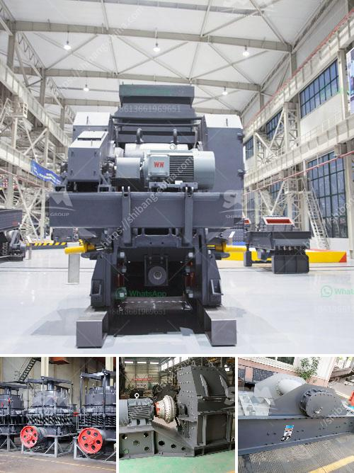

<h3>gold processing ball mills in india china</h3>
Gold is a popular commodity in the investment sector and for good reason. Its rarity, durability, and historical significance have attracted individuals and nations to acquire and store gold as a safe haven asset. However, before gold reaches its refined and ready-to-use form, it goes through a complex processing procedure. One integral aspect of this process is the use of ball mills.

Ball mills have been widely used in the mining industry for over a century and have played a crucial role in the efficient and rapid reduction of mined materials, such as gold ore. These mills are composed of a rotating cylinder filled with balls that grind the material to a fine powder through the cascading and tumbling action of the balls.

India and China have emerged as major players in the gold mining industry. With their rich reserves and increasing demand, these countries have spurred the development of gold processing plants equipped with ball mills. These facilities efficiently extract gold from the ore, breaking it down into manageable sized particles and then refining it further.

One of the benefits of gold processing ball mills is their ability to handle both dry and wet grinding processes. The latter technique, known as wet grinding, is particularly effective in grinding down the ore particles to very small sizes, thereby increasing the surface area for gold extraction. Additionally, ball mills provide a reliable and energy-efficient solution for gold processing, offering high capacity and low maintenance requirements.

Moreover, with advancements in technology, ball mills have evolved to become more efficient and environment-friendly. For instance, some modern ball mills are equipped with sensors and automation systems that optimize the milling process. This ensures the optimal use of energy, reducing operational costs and minimizing environmental impact.

In conclusion, gold processing ball mills have become a vital component in the gold mining industry in India and China. These mills efficiently grind down gold-bearing ore into fine particles, facilitating the extraction process. With their ability to handle both dry and wet grinding, ball mills are versatile and energy-efficient. As technology advancements continue, the future of gold processing ball mills looks promising, offering improved efficiency and sustainability for this crucial step in gold production.
<h3>Contact us</h3><ul><li><strong>Whatsapp:&nbsp;<a href="https://wa.me/8613661969651">+8613661969651</a></strong></li><li><a href="https://swt.shibang-china.com/?git&amp;zhl&amp;gold processing ball mills in india china"><strong>Online Service(chat now)</strong></a></li></ul><h3>Related</h3><ul><li><a href='gold mining project proposal.md'>gold mining project proposal</a></li><li><a href='turkey cement mill plant for sale.md'>turkey cement mill plant for sale</a></li><li><a href='grinding raymond dolomite.md'>grinding raymond dolomite</a></li><li><a href='vibrating classifiing screen.md'>vibrating classifiing screen</a></li><li><a href='calcium carbonate powder making machine.md'>calcium carbonate powder making machine</a></li></ul>