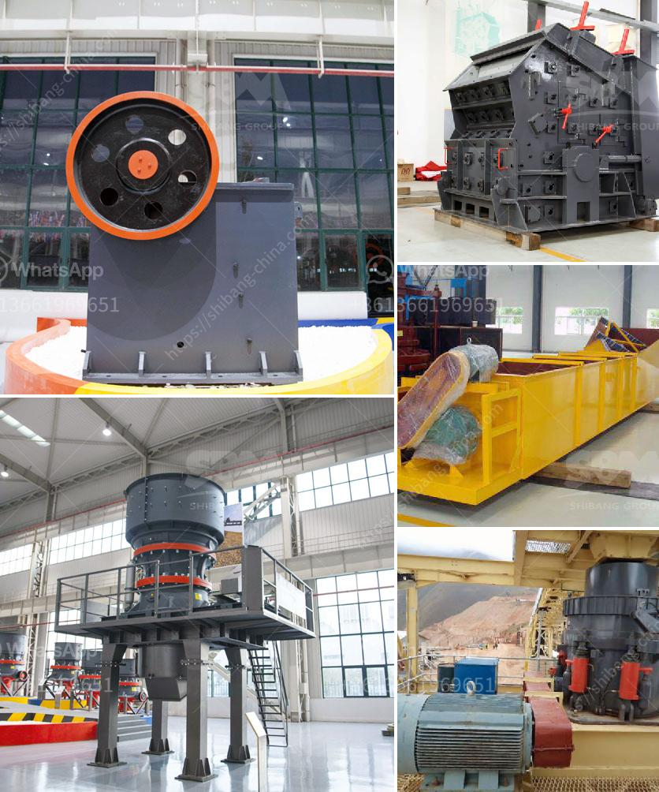

<h3>gold processing silver mercury in south africa</h3>
Gold and silver mining have been a vital part of South Africa's economy and infrastructure for centuries. The nation is endowed with an abundance of precious metal reserves, making it a key player in the global gold and silver mining industry. One crucial element in the gold processing in South Africa is the use of silver mercury to extract the gold.

Silver mercury, also known as quicksilver, is a liquid chemical element that is highly toxic to humans and the environment. Despite its dangers, it plays a vital role in the gold processing industry. The reason for its use lies in its unique ability to amalgamate with gold, forming a solid amalgam. This amalgam can then be easily separated from the impurities through various processes, yielding pure gold.

The process of gold extraction using silver mercury involves several steps. First, the ore is crushed into smaller particles and mixed with water to create a slurry. Then, silver mercury is added to the mixture, creating a reaction that forms the solid amalgam. The slurry is then passed through a series of filters and separators to separate the amalgam from the impurities. Finally, the amalgam is heated in a furnace, vaporizing the mercury and leaving behind pure gold.

While this process has been effective in extracting gold from ores, it poses serious health and environmental risks. Mercury is a non-biodegradable substance, meaning it accumulates in the environment over time. When not handled properly, mercury can contaminate soil and water sources, leading to detrimental effects on ecosystems and human health. Ingesting or inhaling mercury vapor can cause severe neurological damage, kidney problems, and even death.

Over the years, South Africa has taken several measures to address the issues surrounding silver mercury use in gold processing. The government has implemented regulations and guidelines to control the use and disposal of mercury, ensuring the safety of workers and minimizing environmental impact. Additionally, research and development efforts have focused on finding alternative methods for gold extraction that do not rely on mercury.

One such alternative is the use of cyanide, which has become increasingly popular in gold mining. Cyanide is highly effective in extracting gold from ores, and when used responsibly, it can be safer than mercury. However, it still requires strict regulations and proper handling to prevent accidents and environmental contamination.

As South Africa continues to find ways to reduce the reliance on silver mercury in gold processing, the industry must prioritize sustainability and environmental responsibility. While the silver mercury process has been a critical aspect of gold extraction for many years, it is crucial to explore and invest in alternative methods that are safer and more sustainable.

In conclusion, gold processing with silver mercury has played a significant role in South Africa's gold mining industry. However, the use of mercury poses serious health and environmental risks that need to be addressed. The nation must continue to develop and implement safer and more sustainable methods for gold extraction, ensuring the longevity of the industry while minimizing its environmental footprint.
<h3>Contact us</h3><ul><li><strong>Whatsapp:&nbsp;<a href="https://wa.me/8613661969651">+8613661969651</a></strong></li><li><a href="https://swt.shibang-china.com/?git&amp;zhl&amp;gold processing silver mercury in south africa"><strong>Online Service(chat now)</strong></a></li></ul><h3>Related</h3><ul><li><a href='coal washing process machine.md'>coal washing process machine</a></li><li><a href='crushing plant in pangasinan.md'>crushing plant in pangasinan</a></li><li><a href='dolomite powder machine.md'>dolomite powder machine</a></li><li><a href='second hand quarry crusher machinery price in india.md'>second hand quarry crusher machinery price in india</a></li><li><a href='vertical mill for calcite.md'>vertical mill for calcite</a></li></ul>