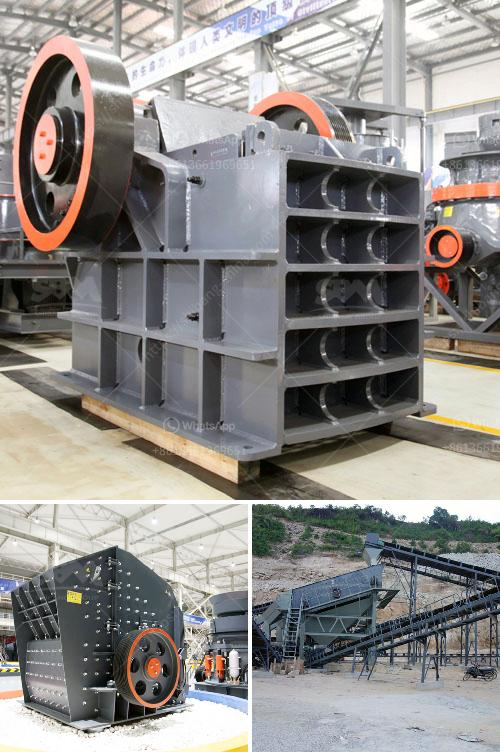

<h3>gold production process flow chart</h3>
Gold is a precious metal that is highly sought after for its aesthetic and economic value. Its shimmering beauty and rarity make it a popular choice for jewelry, investment, and even technology applications. However, many people are unaware of the intricate process involved in gold production.

To understand the gold production process, it is essential to have a clear understanding of the flow chart. In essence, the gold ore is mined from the earth and transported to a processing plant. The ore undergoes various stages of crushing, grinding, and flotation to produce a concentrate with a high gold content. This concentrate is then smelted to obtain pure gold.

The process begins with mining operations, where the ore is extracted from the earth using a combination of mechanical and chemical methods. The ore is then transported to the processing plant, often located hundreds or even thousands of miles away. Once at the plant, the ore is crushed and ground into fine particles.

Next, the ore is subjected to a flotation process. This involves adding chemicals to the ore, which react with the gold particles to form a froth that can be skimmed off. The froth is then further processed to obtain a concentrate with a high gold content.

Once the concentrate is obtained, it is smelted to produce pure gold. Smelting involves heating the concentrate in a furnace to separate the gold from other impurities. The impurities are then removed, and the melted gold is cast into bars or other desired shapes.

Finally, the gold is refined to remove any remaining impurities and ensure it meets the desired purity standards. This may involve additional processes such as electrolysis or chemical precipitation.

In conclusion, the production of gold involves a complex and multi-step process. From mining and crushing the ore to smelting and refining, each stage is crucial in producing pure gold. Understanding this flow chart is essential to appreciate the efforts and expertise involved in bringing this precious metal from the earth to our hands.
<h3>Contact us</h3><ul><li><strong>Whatsapp:&nbsp;<a href="https://wa.me/8613661969651">+8613661969651</a></strong></li><li><a href="https://swt.shibang-china.com/?git&amp;zhl&amp;gold production process flow chart"><strong>Online Service(chat now)</strong></a></li></ul><h3>Related</h3><ul><li><a href='price of stone crusher stone crusher.md'>price of stone crusher stone crusher</a></li><li><a href='jaw crusher part diagram.md'>jaw crusher part diagram</a></li><li><a href='listing price tons per hour screw conveyor.md'>listing price tons per hour screw conveyor</a></li><li><a href='mining machinery companies in germany.md'>mining machinery companies in germany</a></li><li><a href='pioneer ve rock crusher.md'>pioneer ve rock crusher</a></li></ul>