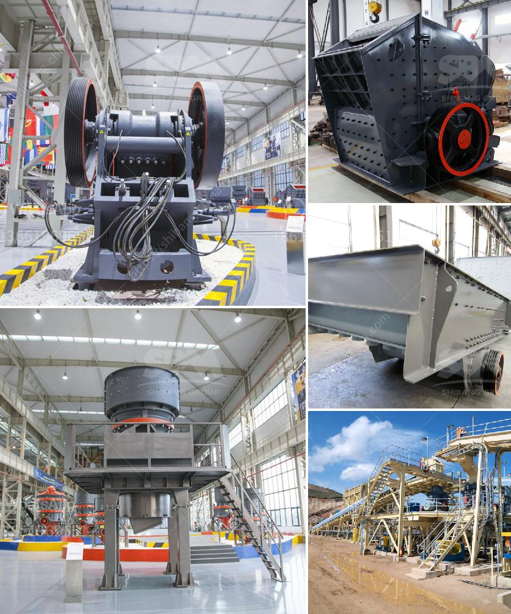

<h3>gold recovery process flow diagram pdf</h3>
Gold recovery processes are crucial in the mining industry, where the extraction and recovery of gold from ores is of utmost importance. The gold recovery process flow diagram outlines the steps specifically followed to reclaim gold from its ore using various techniques.

The process starts with ore transportation, where ores are excavated and transported to the processing plant. Upon arrival, the ores go through the crushing process to break them down into smaller pieces, making it easier to extract gold. This is followed by grinding, where the ores are further reduced in size using grinding mills.

Once the ore is sufficiently ground, it undergoes a process called cyanidation. In this step, the ore is mixed with water and a weak cyanide solution, which helps dissolve the gold. This mixture is then agitated, allowing the cyanide to react with the gold particles, forming a soluble complex called a gold cyanide complex.

Next, the gold cyanide complex is separated from the rest of the ore using techniques such as filtration or solid-liquid separation. The pregnant solution, containing the dissolved gold, is then treated with activated carbon, a highly porous material that adsorbs the gold cyanide complex. This results in the gold being concentrated onto the carbon, while the rest of the impurities stay in the solution.

After the gold has been adsorbed onto the activated carbon, the carbon is separated from the solution through processes like carbon-in-pulp (CIP) or carbon-in-leach (CIL). These techniques involve washing the carbon with a caustic cyanide solution, desorbing the gold from the carbon, and then reactivating the carbon for reuse in the process.

Once the gold has been desorbed from the carbon, it is then recovered through electro-winning or precipitation. Electro-winning involves passing an electric current through the gold-bearing solution, causing the gold ions to migrate to the cathode, where they are plated out onto stainless steel or other suitable materials. Precipitation, on the other hand, involves adding a chemical reagent to the gold-bearing solution, which causes the gold to form solid particles that can be separated from the solution.

Finally, the gold is further refined to remove any remaining impurities. This is typically done through processes like smelting or refining, where the gold is heated to high temperatures to separate it from other elements. The resulting gold is then cast into ingots or bars, ready for sale or further fabrication.

In conclusion, the gold recovery process flow diagram outlines the various steps required to extract and recover gold from its ores. Each step is crucial and requires careful planning and execution. By following this process, mining companies can efficiently recover gold, ensuring the precious metal is put to good use while minimizing environmental impacts.
<h3>Contact us</h3><ul><li><strong>Whatsapp:&nbsp;<a href="https://wa.me/8613661969651">+8613661969651</a></strong></li><li><a href="https://swt.shibang-china.com/?git&amp;zhl&amp;gold recovery process flow diagram pdf"><strong>Online Service(chat now)</strong></a></li></ul><h3>Related</h3><ul><li><a href='harga mesin raymond mill indonesia.md'>harga mesin raymond mill indonesia</a></li><li><a href='portable crushing plant.md'>portable crushing plant</a></li><li><a href='hammer mill santa cross.md'>hammer mill santa cross</a></li><li><a href='argentine hammer mills.md'>argentine hammer mills</a></li><li><a href='quarry crusher machines for sale.md'>quarry crusher machines for sale</a></li></ul>