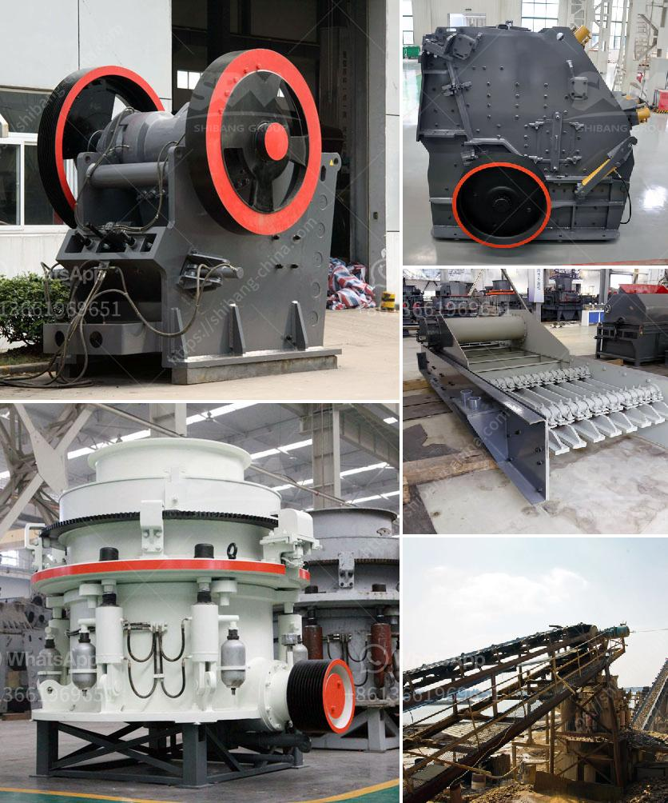

<h3>gold refining chemicals list</h3>
Gold refining, or the purification of gold, has been a practice throughout history. The process of refining gold involves the use of various chemicals to remove impurities and achieve a high level of purity. This article will present a comprehensive list of gold refining chemicals and discuss their uses in the refining process.

1. Aqua Regia: Aqua Regia, a mixture of nitric acid and hydrochloric acid, is one of the most commonly used gold refining chemicals. It can dissolve impressive amounts of gold, making it an excellent choice for refining gold alloys or gold nuggets. Aqua Regia oxidizes the gold and forms soluble gold chloride, which can then be further purified.

2. Nitric Acid (HNO3): Nitric acid is a strong oxidizing agent and plays a crucial role in dissolving base metals present in gold alloys. It can react with copper, zinc, and other base metals that might contaminate the gold, leaving behind only the purified gold.

3. Hydrochloric Acid (HCl): Hydrochloric acid is often used in conjunction with nitric acid in the Aqua Regia mixture. While nitric acid attacks the base metals, hydrochloric acid assists in the dissolution process by maintaining a low pH level. This chemical combination helps achieve better gold dissolution and purification.

4. Borax (Na2B4O7·10H2O): Borax, commonly known as sodium borate, is added to the gold refining process to reduce the melting point of metals present in the gold alloy. This facilitates the separation of impurities, as lower melting point metals can be easily removed during the refining process.

5. Soda Ash (Na2CO3): Soda Ash, also known as sodium carbonate, is often used as a pH regulator in the gold refining process. It helps neutralize the acidic nature of the Aqua Regia solution, allowing for controlled reactions while dissolving base metals.

6. Urea (CO(NH2)2): Urea is commonly used as a reducing agent during gold refining. It helps prevent the loss of gold and minimizes the formation of unwanted insoluble compounds. Urea also aids in the precipitation of gold from the Aqua Regia solution.

7. Sodium Metabisulfite (Na2S2O5): Sodium Metabisulfite is a compound commonly used as a reducing agent in gold refining. It helps in the precipitation of gold from the Aqua Regia solution, allowing it to be easily separated and recovered.

8. Ammonium Chloride (NH4Cl): Ammonium Chloride is sometimes used during gold refining to minimize the presence of unwanted impurities. It aids in the removal of certain base metals, ensuring a higher level of purity in the final refined gold product.

It is essential to note that gold refining processes can vary depending on the starting materials and desired purity level. Professionals and experts in the field should handle gold refining processes due to the hazardous nature of some chemicals used. Safety precautions should always be followed, including wearing proper protective gear, working in a well-ventilated area, and disposing of chemicals properly.

In conclusion, gold refining chemicals play a vital role in the purification process, allowing for the removal of impurities and the achievement of a high level of gold purity. Aqua Regia, nitric acid, hydrochloric acid, borax, soda ash, urea, sodium metabisulfite, and ammonium chloride are some common gold refining chemicals used. These chemicals facilitate gold dissolution, separation of impurities, and the recovery of purified gold. Safe handling and disposal procedures should always be followed when working with gold refining chemicals.
<h3>Contact us</h3><ul><li><strong>Whatsapp:&nbsp;<a href="https://wa.me/8613661969651">+8613661969651</a></strong></li><li><a href="https://swt.shibang-china.com/?git&amp;zhl&amp;gold refining chemicals list"><strong>Online Service(chat now)</strong></a></li></ul><h3>Related</h3><ul><li><a href='hammer crusher taiwan.md'>hammer crusher taiwan</a></li><li><a href='calcium carbonate powder making machine.md'>calcium carbonate powder making machine</a></li><li><a href='calcium carbonate powder crushing crusher usa.md'>calcium carbonate powder crushing crusher usa</a></li><li><a href='gold wash plant irs california.md'>gold wash plant irs california</a></li><li><a href='production rate limestone crusher.md'>production rate limestone crusher</a></li></ul>