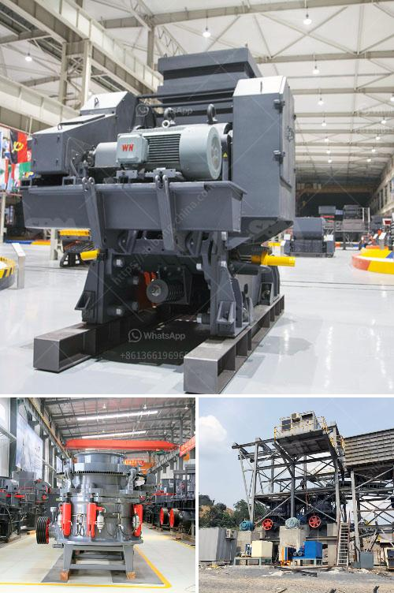

<h3>gold refining machine capacity 2 tons per day</h3>
The gold refining industry plays a crucial role in providing high-quality gold for various sectors, including jewelry, electronics, and investments. As demand for gold continues to increase, refining facilities seek ways to improve their processes and increase their capacity to meet market demands. One significant technological advancement in this field is the introduction of gold refining machines with a capacity of 2 tons per day.

Gold refining machines with a capacity of 2 tons per day have revolutionized the way gold refining processes are conducted. These efficient machines provide refining facilities with the ability to process large quantities of gold in relatively shorter time frames, compared to traditional refining methods. This increased capacity helps meet the demand for gold and ensures a steady supply to the market.

One notable advantage of a gold refining machine with a capacity of 2 tons per day is its ability to eliminate human errors. Automated processes reduce the risk of mistakes, ensuring the highest possible quality and purity of the refined gold. Furthermore, these machines often come equipped with advanced technological features to increase their efficiency, such as precise temperature and pressure control for optimal refining conditions.

Efficiency is another key benefit that comes with the use of these gold refining machines. The refining process is streamlined, minimizing delays and maximizing productivity. With the ability to refine up to 2 tons of gold per day, refining facilities can significantly increase their output and process larger consignments. This, in turn, allows them to meet the demands of clients promptly and efficiently.

Furthermore, the increased capacity offered by these machines enables refining facilities to handle complex refining tasks effectively. Different types of gold, including scrap gold, impure gold, and gold alloys, can all be efficiently processed. This versatility is essential in meeting the diverse needs of the gold market, ensuring that all gold received by the facility can be refined to the highest standards.

These machines also contribute to refining facilities' cost-effectiveness, as they minimize overhead expenses and enhance resource allocation. The automated nature of the process requires fewer manual interventions and reduces the need for skilled labor. By running precise and efficient operations, refining facilities can optimize their resource utilization, ultimately leading to higher cost savings.

In conclusion, gold refining machines with a capacity of 2 tons per day have transformed the gold refining industry. These machines offer refining facilities with the ability to process larger quantities of gold, improve efficiency, eliminate human errors, and handle various types of gold. The increased capacity of these machines ensures consistent and timely supply to the gold market while enhancing productivity and reducing costs. As the demand for gold continues to grow, investing in such advanced machinery is becoming an essential step for refining facilities to stay competitive in the industry.
<h3>Contact us</h3><ul><li><strong>Whatsapp:&nbsp;<a href="https://wa.me/8613661969651">+8613661969651</a></strong></li><li><a href="https://swt.shibang-china.com/?git&amp;zhl&amp;gold refining machine capacity 2 tons per day"><strong>Online Service(chat now)</strong></a></li></ul><h3>Related</h3><ul><li><a href='mobile crusher hire in uae.md'>mobile crusher hire in uae</a></li><li><a href='how much crusher cost.md'>how much crusher cost</a></li><li><a href='mini crusher hire johannesburg.md'>mini crusher hire johannesburg</a></li><li><a href='material used in vertical mill.md'>material used in vertical mill</a></li><li><a href='aggregate manufacturing process.md'>aggregate manufacturing process</a></li></ul>