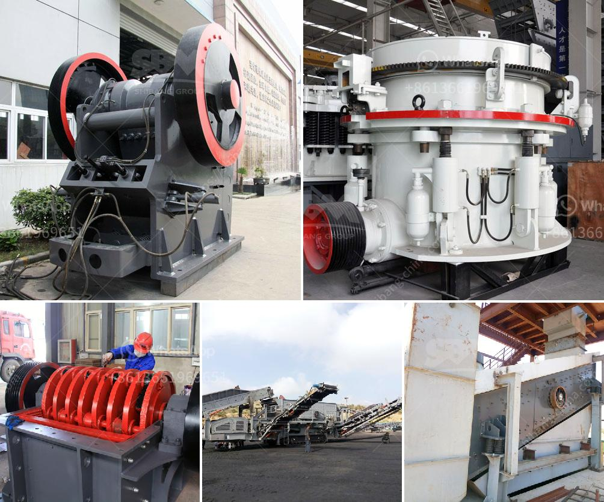

<h3>gold wash plant irs california</h3>
California has long been synonymous with gold. From the famous Gold Rush in the mid-1800s to the modern-day mining operations, this state continues to attract gold miners from all over the world. One of the key tools in the gold mining industry is the gold wash plant, which helps miners efficiently extract gold from the soil or gravel.

A gold wash plant is a machine that separates gold-bearing material from other debris like rocks, clay, and sand. It functions like a giant sieve, washing out the dirt and leaving only the gold particles behind. This equipment has revolutionized the gold mining industry, making it faster, more efficient, and more profitable.

In California, gold mining operations using wash plants have soared in recent years due to the high market demand for gold. The Internal Revenue Service (IRS) has also recognized the potential profitability of this industry. As a result, the IRS has implemented regulations specific to the gold wash plant business in California.

One such regulation is the requirement for miners to obtain the necessary permits and licenses to operate a gold wash plant in California. The state's stringent environmental laws ensure that miners comply with strict regulations to protect natural resources and prevent pollution. These permits serve as a legal foundation for operating a gold wash plant and provide assurance to potential investors and buyers.

Additionally, the IRS has guidelines on tax reporting and deductions for gold miners. California-based miners need to report their earnings accurately and pay the corresponding taxes. However, the IRS also acknowledges that operating a gold wash plant incurs various expenses, such as fuel, maintenance, and repairs. These expenses are typically tax-deductible, potentially reducing the taxes owed by miners.

Ultimately, investing in a gold wash plant in California can be a highly profitable venture. The state's rich gold deposits coupled with the IRS's recognition of the industry's potential offer a favorable environment for success. However, it is important for miners to adhere to all relevant regulations and diligently report their earnings to the IRS.

With proper planning, compliance, and hard work, a gold wash plant operation in California can lead to significant financial gains. It is a chance to participate in the state's illustrious gold mining history and contribute to its thriving modern gold industry. So, if you're considering investing in a gold wash plant, California might just be the golden opportunity you've been looking for.
<h3>Contact us</h3><ul><li><strong>Whatsapp:&nbsp;<a href="https://wa.me/8613661969651">+8613661969651</a></strong></li><li><a href="https://swt.shibang-china.com/?git&amp;zhl&amp;gold wash plant irs california"><strong>Online Service(chat now)</strong></a></li></ul><h3>Related</h3><ul><li><a href='portable cone crusher specification.md'>portable cone crusher specification</a></li><li><a href='fine powder grinding mill.md'>fine powder grinding mill</a></li><li><a href='stone crusher plant for sale philippines.md'>stone crusher plant for sale philippines</a></li><li><a href='portable crusher rental in las vegas.md'>portable crusher rental in las vegas</a></li><li><a href='calculating capacity of a roll crusher.md'>calculating capacity of a roll crusher</a></li></ul>