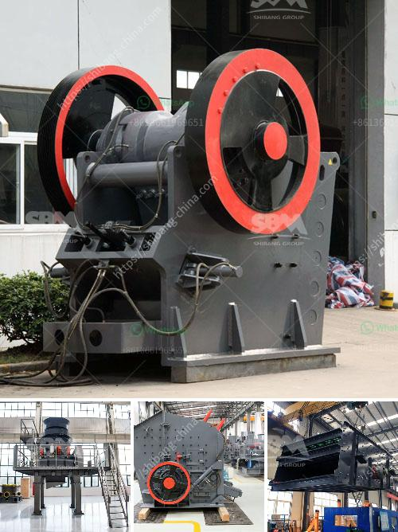

<h3>gold washer machine manufacturer</h3>
In today's fast-paced world, where time is of the essence, industries across the globe are constantly searching for innovative solutions that can enhance productivity and efficiency. Among the various sectors that benefit greatly from such developments is the mining industry, which heavily relies on gold washer machines to extract valuable minerals. With technological advancements paving the way for success, gold washer machine manufacturers are playing a vital role by delivering state-of-the-art equipment that elevates efficiency and productivity to new heights.

A gold washer machine, also known as a gold washing plant, is a specialized piece of equipment used to extract gold from sand and gravel deposits. These machines utilize various techniques, such as high-pressure jets of water, pulsating water currents, and powerful suction systems, to separate and recover gold particles from other unwanted materials.

One prominent gold washer machine manufacturer leading the industry is XYZ Technologies. With years of expertise and a reputation for excellence, XYZ Technologies has continually revolutionized the gold washing plant sector by incorporating innovative features that optimize productivity while minimizing environmental impact.

One noteworthy feature implemented by gold washer machine manufacturers like XYZ Technologies is the use of advanced screening technology. By incorporating screens with varying mesh sizes, the machines can efficiently classify materials, separating larger rocks and debris from the finer sediments containing gold particles. This ensures that the gold extraction process is more focused and precise, resulting in higher yields and reduced wastage.

Another cutting-edge technology integrated into modern gold washer machines is the utilization of centrifugal force. Centrifugal gold concentrators, a variation of the traditional gold washer machines, are equipped with spinning bowls that create a centrifugal force field. This force causes gold particles to be trapped within the concentric rings of the bowl, while lighter materials get flushed out. This innovative approach accelerates the extraction process and allows for higher gold recovery rates.

Furthermore, gold washer machine manufacturers are increasingly adopting eco-friendly practices to reduce energy consumption and minimize environmental impact. XYZ Technologies, for instance, has integrated energy-efficient motors and pumps into their machines, significantly reducing power consumption without compromising performance. Additionally, the incorporation of recycling systems allows for the reuse of water, reducing the overall water footprint of the gold washing process.

Continuous technological advancements by gold washer machine manufacturers are not limited to the physical aspects of the equipment. Nowadays, many manufacturers are incorporating automation and digitalization features into their machines, allowing operators to monitor and control gold washing plants remotely. Real-time data collection and analysis aid in optimizing operations, streamlining maintenance, and increasing overall efficiency. Such advancements enable technicians to identify potential issues, reducing downtime and maximizing machine uptime.

In conclusion, gold washer machine manufacturers are at the forefront of technological innovation, striving to deliver equipment that boosts productivity and efficiency in the mining industry. The inclusion of advanced screening technology, centrifugal force concentrators, and eco-friendly practices are revolutionizing the gold washing plant sector. Furthermore, integrating automation and digitalization features enhances monitoring and control, ensuring smooth operations and minimizing downtime. As the industry continues to evolve, gold washer machine manufacturers like XYZ Technologies will be crucial in sculpting the future of gold extraction, helping mining companies maximize profitability while minimizing environmental impact.
<h3>Contact us</h3><ul><li><strong>Whatsapp:&nbsp;<a href="https://wa.me/8613661969651">+8613661969651</a></strong></li><li><a href="https://swt.shibang-china.com/?git&amp;zhl&amp;gold washer machine manufacturer"><strong>Online Service(chat now)</strong></a></li></ul><h3>Related</h3><ul><li><a href='set up a quarry plant.md'>set up a quarry plant</a></li><li><a href='puzzolana 200 tph stage aggregate crushing.md'>puzzolana 200 tph stage aggregate crushing</a></li><li><a href='full crushing plants germiston.md'>full crushing plants germiston</a></li><li><a href='used crushing plant johannesburg.md'>used crushing plant johannesburg</a></li><li><a href='powder grinding mill.md'>powder grinding mill</a></li></ul>