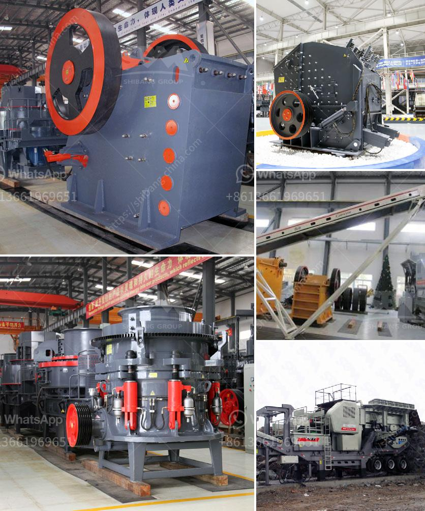

<h3>gold washing equipment portable</h3>
Gold mining has been a lucrative business for centuries, and it continues to attract prospectors and entrepreneurs from all corners of the world. With advancements in technology, the methods and equipment used in gold mining have significantly evolved. One such innovation that has revolutionized the industry is portable gold washing equipment.

Portable gold washing equipment refers to a compact and lightweight machine that is designed to wash and separate gold-bearing soil or gravel. This equipment is specifically crafted to be easily transported and operated in remote or hard-to-reach areas, allowing miners to efficiently extract gold without the need for large-scale machinery or extensive manpower.

One of the primary advantages of portable gold washing equipment is its mobility. Traditional gold mining techniques often require extensive infrastructure and heavy machinery, which can be expensive to transport and assemble. Portable equipment, on the other hand, can be easily transported and quickly set up, reducing the logistical challenges associated with traditional mining methods. This portability not only saves time and money but also allows miners to explore previously inaccessible areas that may contain high concentrations of gold deposits.

The compact size of portable gold washing equipment does not compromise its functionality. Most portable units are equipped with sieves, classifiers, and screens that efficiently separate gold particles from other debris. Depending on the model, these machines may also contain sluice boxes or gold concentrators, which further enhance the gold recovery process. The ability to effectively separate and recover gold without the need for extensive equipment is a significant advantage for small-scale miners or those operating in remote locations.

Another key benefit of portable gold washing equipment is its environmental friendliness. In traditional gold mining, large amounts of land are often excavated and rivers or streams are redirected to uncover gold deposits. These practices can cause significant disruption to ecosystems, creating pollution and destroying habitats. Portable equipment minimizes these environmental impacts by allowing miners to focus on specific areas and avoid large-scale disturbance. Furthermore, some portable units have built-in water recycling systems, reducing water consumption and wastage.

Despite the numerous advantages, portable gold washing equipment does have limitations. Due to their size, these machines may not be suitable for large-scale mining operations. Additionally, they are generally intended for gold mining in riverbeds, streams, or areas with loose soil. Hard rock mining or extracting gold from underground veins may require more specialized equipment.

In conclusion, portable gold washing equipment has emerged as a game-changer in the gold mining industry. This compact and portable machinery has made gold mining more accessible and efficient, particularly for small-scale miners or those working in remote areas. Its mobility, functionality, and environmental friendliness make it an attractive option for gold prospectors seeking to maximize their yield while minimizing their environmental impact. As technology continues to advance, it is likely that portable gold washing equipment will become even more efficient, further contributing to the growth and success of the gold mining industry.
<h3>Contact us</h3><ul><li><strong>Whatsapp:&nbsp;<a href="https://wa.me/8613661969651">+8613661969651</a></strong></li><li><a href="https://swt.shibang-china.com/?git&amp;zhl&amp;gold washing equipment portable"><strong>Online Service(chat now)</strong></a></li></ul><h3>Related</h3><ul><li><a href='coal pulverizer machine hammer.md'>coal pulverizer machine hammer</a></li><li><a href='coal pulverizer machine.md'>coal pulverizer machine</a></li><li><a href='mining calcium carbonate vietnam.md'>mining calcium carbonate vietnam</a></li><li><a href='used jaw crushers with price in pakistan.md'>used jaw crushers with price in pakistan</a></li><li><a href='jaw crushers from saudi.md'>jaw crushers from saudi</a></li></ul>