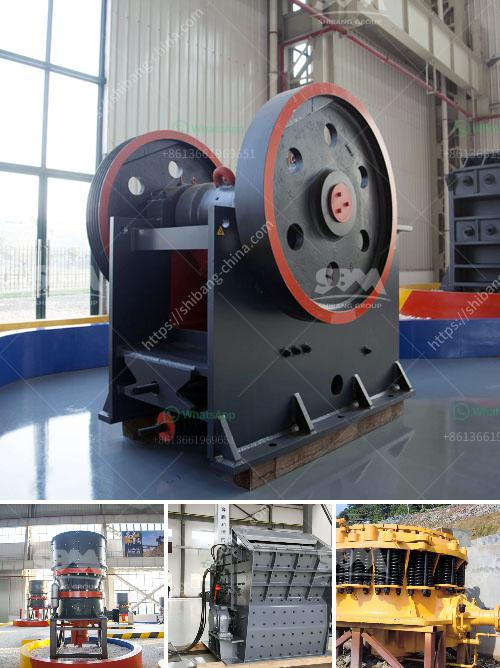

<h3>gold washing machine</h3>
Gold mining has been a significant industry for centuries, attracting prospectors from all corners of the world with promises of wealth and success. Throughout the years, different techniques and machinery have been developed to simplify the extraction of this precious metal. One such innovation that revolutionized the mining industry is the gold washing machine.

A gold washing machine is a specialized piece of equipment specifically designed to efficiently and effectively wash out the impurities and sediments from gold-bearing ore. It utilizes water and mechanical agitation to separate the gold particles from other materials, ensuring a higher concentration of gold is obtained.

The traditional method of gold extraction involved panning, where miners would manually agitate a pan filled with water and sediment, causing the denser gold particles to settle at the bottom. Although this method was effective to some extent, it required substantial physical effort and was time-consuming. As technology advanced, so did the mining equipment.

The introduction of the gold washing machine brought a drastic improvement in the efficiency of gold extraction. It replaced the slow and labor-intensive panning method, allowing miners to process a significantly larger volume of material in a shorter time. This quantum leap in productivity revolutionized the mining industry and contributed to increased gold production worldwide.

One of the key features that distinguish a gold washing machine from other mining equipment is its ability to handle various types of ores. Whether it is alluvial, placer, or hard rock deposits, these machines can effectively extract gold from the ore. This versatility is crucial, as gold deposits can vary significantly in their composition and characteristics across different regions and geological formations.

The design of a gold washing machine also plays a vital role in its efficiency. These machines typically consist of a vibrating screen or trommel, which efficiently separates larger-sized gravel and sediment from smaller-sized particles. The gold-bearing material is then transported onto riffle tables, where the denser gold particles are trapped as water flows over them. This process relies on the specific gravity of gold to separate it from lighter materials.

Moreover, modern gold washing machines often incorporate additional features and technologies to enhance their performance. Some machines are equipped with sluice boxes or jigs, which provide a secondary separation step to ensure maximum gold recovery. Others may use centrifugal force to further refine the separation process, taking advantage of the differences in density between gold and other materials.

The advantages of using a gold washing machine extend beyond just increased productivity. These machines also have a positive environmental impact by minimizing the need for chemical-based extraction methods. Unlike processes that rely on chemicals like cyanide, gold washing machines use water as the primary medium for separation. This reduces the potential harm to ecosystems and surrounding communities that can result from using hazardous chemicals.

In conclusion, gold washing machines have undoubtedly transformed the mining industry. With their ability to efficiently extract gold from various types of ores, these machines have increased productivity, reduced environmental impact, and improved the overall efficiency of gold extraction operations. As technology continues to advance, it is likely that further innovations in gold washing machines will only enhance the industry's potential for future growth and sustainability.
<h3>Contact us</h3><ul><li><strong>Whatsapp:&nbsp;<a href="https://wa.me/8613661969651">+8613661969651</a></strong></li><li><a href="https://swt.shibang-china.com/?git&amp;zhl&amp;gold washing machine"><strong>Online Service(chat now)</strong></a></li></ul><h3>Related</h3><ul><li><a href='concrete crushing machine cost.md'>concrete crushing machine cost</a></li><li><a href='ball mill manufacturers in malaysia.md'>ball mill manufacturers in malaysia</a></li><li><a href='cement grinding mill price invest cost.md'>cement grinding mill price invest cost</a></li><li><a href='processing of copper crusher.md'>processing of copper crusher</a></li><li><a href='german made jaw crusher prices.md'>german made jaw crusher prices</a></li></ul>