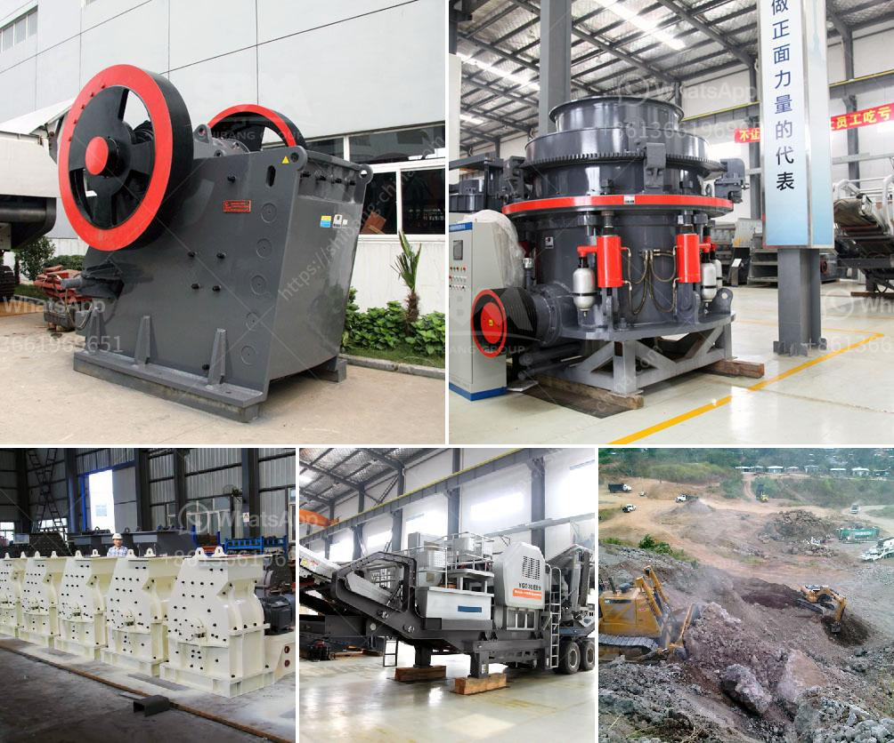

<h3>granite crusher plant</h3>
Granite is a common type of igneous rock that is granular in texture. Due to its high durability and aesthetic qualities, it is widely used as a building material. To obtain granite from a quarry, it is first blasted and then transported to a crushing plant. At the plant, the granite is crushed into smaller, more manageable pieces.

A granite crusher plant is a key component in the process of breaking down rocks into smaller pieces. This machinery includes multiple types of crushers: jaw crusher, cone crusher, impact crusher, and sand making machine. This ensures that the materials are efficiently crushed to the desired size and shape.

The granite crusher plant plays a crucial role in producing high-quality crushed stones used for construction purposes. These crushed stones are used as raw materials for various construction activities such as building roads, bridges, buildings, and canals. The plant ensures that the granite is processed and crushed to the correct specifications to meet the demands of construction projects.

One of the significant advantages of using a granite crusher plant is its high efficiency. With a well-designed and calibrated crusher plant, the process of crushing granite into various sizes becomes much more productive. This saves time and reduces the need for additional manual labor.

Furthermore, a granite crusher plant also helps to minimize waste and environmental impact. This is achieved by reducing the amount of material that needs to be extracted from quarries by recycling and reusing the crushed granite. The use of recycled materials decreases the demand for fresh quarry sites, which can contribute to the preservation of natural resources and habitats.

In conclusion, a granite crusher plant plays a crucial role in the production of high-quality crushed stones used for various construction purposes. Its efficiency and environmental benefits make it an essential component in the construction industry. By recycling and reusing crushed granite, the plant also helps to conserve natural resources and reduce waste.
<h3>Contact us</h3><ul><li><strong>Whatsapp:&nbsp;<a href="https://wa.me/8613661969651">+8613661969651</a></strong></li><li><a href="https://swt.shibang-china.com/?git&amp;zhl&amp;granite crusher plant"><strong>Online Service(chat now)</strong></a></li></ul><h3>Related</h3><ul><li><a href='vertical mill for calcite.md'>vertical mill for calcite</a></li><li><a href='fine grinding mill specifications.md'>fine grinding mill specifications</a></li><li><a href='business plan and cost for crushing project.md'>business plan and cost for crushing project</a></li><li><a href='barite grinding companies.md'>barite grinding companies</a></li><li><a href='jaw crusher 10 x 20.md'>jaw crusher 10 x 20</a></li></ul>