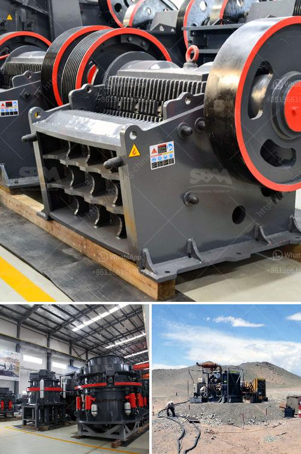

<h3>granite mining machinery</h3>
Granite is an igneous rock that is made up of primarily quartz, feldspar, and mica. It is formed from the cooling and solidification of magma beneath the Earth's surface. Granite mining is a massive industrial process that digs into the ground to extract granite from the Earth. Granite has been used for thousands of years in both interior and exterior applications. It is highly durable, resistant to weathering, and has a beautiful natural appearance, making it a popular choice for construction and decoration.

Mining granite requires a unique set of machinery. Granite mining machinery has evolved over time and today includes an array of state-of-the-art equipment designed specifically for this industry. Some of the machinery used in granite mining includes excavators, loaders, drilling and blasting equipment, and crushers.

Excavators are used to remove the overburden or topsoil above the granite deposits. This process prepares the area for the extraction of the granite. Excavators can be used to remove large quantities of soil quickly and efficiently, saving both time and manpower.

Loaders are then used to transport the granite from the mine to the processing plant. These heavy-duty machines are equipped with large buckets that can move large amounts of granite at once. Loaders are essential for efficient granite mining operations as they help expedite the transportation process.

Drilling and blasting equipment is used to create tunnels and boreholes in the granite deposits. This equipment is crucial for accessing the granite beneath the surface. Drilling machines use specialized drill bits to penetrate the rock, and explosives are then used to break up the granite into manageable pieces.

Once the granite has been extracted, crushing equipment is used to further break down the large pieces into smaller, more manageable sizes. Crushers are responsible for reducing the size of the granite to a suitable size for transportation and processing. This process allows for easier handling and processing of the granite, saving both time and resources.

In recent years, technological advancements have improved the efficiency and safety of granite mining machinery. Automated systems and remote-controlled machinery have streamlined the extraction process, reducing the need for manual labor and increasing productivity. These technological advancements have also improved worker safety by minimizing exposure to hazardous conditions.

Despite the technological advancements, granite mining machinery still requires skilled operators who are knowledgeable about the equipment and the extraction process. Training programs and strict safety protocols are implemented to ensure the well-being of the workers and the efficient operation of the machinery.

In conclusion, granite mining machinery plays a vital role in the extraction and processing of granite. The machinery used in granite mining has evolved over time, incorporating advanced technology to improve productivity, safety, and efficiency. From excavators to crushers, each piece of equipment serves a specific purpose in the mining process. With ongoing technological advancements, the granite mining industry can continue to thrive while minimizing its environmental impact and maximizing its economic potential.
<h3>Contact us</h3><ul><li><strong>Whatsapp:&nbsp;<a href="https://wa.me/8613661969651">+8613661969651</a></strong></li><li><a href="https://swt.shibang-china.com/?git&amp;zhl&amp;granite mining machinery"><strong>Online Service(chat now)</strong></a></li></ul><h3>Related</h3><ul><li><a href='used crusher price in nigeria.md'>used crusher price in nigeria</a></li><li><a href='speed in rollal mill.md'>speed in rollal mill</a></li><li><a href='grinding machine types use in cement industry.md'>grinding machine types use in cement industry</a></li><li><a href='kaolin raymond mill price.md'>kaolin raymond mill price</a></li><li><a href='for sale prices jaw crushe.md'>for sale prices jaw crushe</a></li></ul>