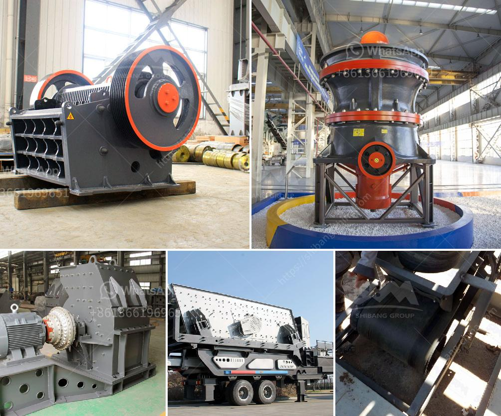

<h3>granite processing plant prices</h3>
Granite has become one of the most popular materials used in construction and decoration due to its durability and aesthetic appeal. As a result, the demand for granite has increased significantly, leading to the establishment of many granite processing plants worldwide. However, when it comes to choosing the right granite processing plant, factors such as prices and quality play a crucial role.

The prices of granite processing plants can vary widely depending on various factors. One of the significant factors that determine the price is the capacity of the plant. Plants with higher capacities tend to be more expensive than those with lower capacities. Additionally, the level of automation and technology used in the processing plant also affects the price. Plants equipped with advanced machinery and automation usually come at a higher price due to increased productivity and efficiency.

Moreover, the quality of the finished granite products also impacts the prices. Processing plants that prioritize quality assurance and invest in advanced cutting and polishing techniques may charge higher prices for their products. The use of modern technology and skilled labor in the processing plant contributes to superior finishes and ensures customer satisfaction.

It is essential for buyers to carefully consider their requirements and budget before selecting a granite processing plant. Comparing prices from different suppliers and thoroughly evaluating their quality standards is crucial to strike the right balance between cost and quality. Consulting with industry experts or seeking recommendations from trusted sources can also be helpful in making an informed decision.

In conclusion, the price of a granite processing plant depends on multiple factors, including capacity, automation level, and quality standards. Balancing the costs with the desired quality is essential for buyers in the construction and decoration industry. By conducting thorough research and considering all parameters, buyers can find the ideal granite processing plant that meets their requirements and budget efficiently.
<h3>Contact us</h3><ul><li><strong>Whatsapp:&nbsp;<a href="https://wa.me/8613661969651">+8613661969651</a></strong></li><li><a href="https://swt.shibang-china.com/?git&amp;zhl&amp;granite processing plant prices"><strong>Online Service(chat now)</strong></a></li></ul><h3>Related</h3><ul><li><a href='sand conveyor for sale.md'>sand conveyor for sale</a></li><li><a href='gold mining equipment plant for sales.md'>gold mining equipment plant for sales</a></li><li><a href='sand manufacturing machines china.md'>sand manufacturing machines china</a></li><li><a href='stone crushing industry tanzania.md'>stone crushing industry tanzania</a></li><li><a href='ballast crushing machines in nairobi.md'>ballast crushing machines in nairobi</a></li></ul>