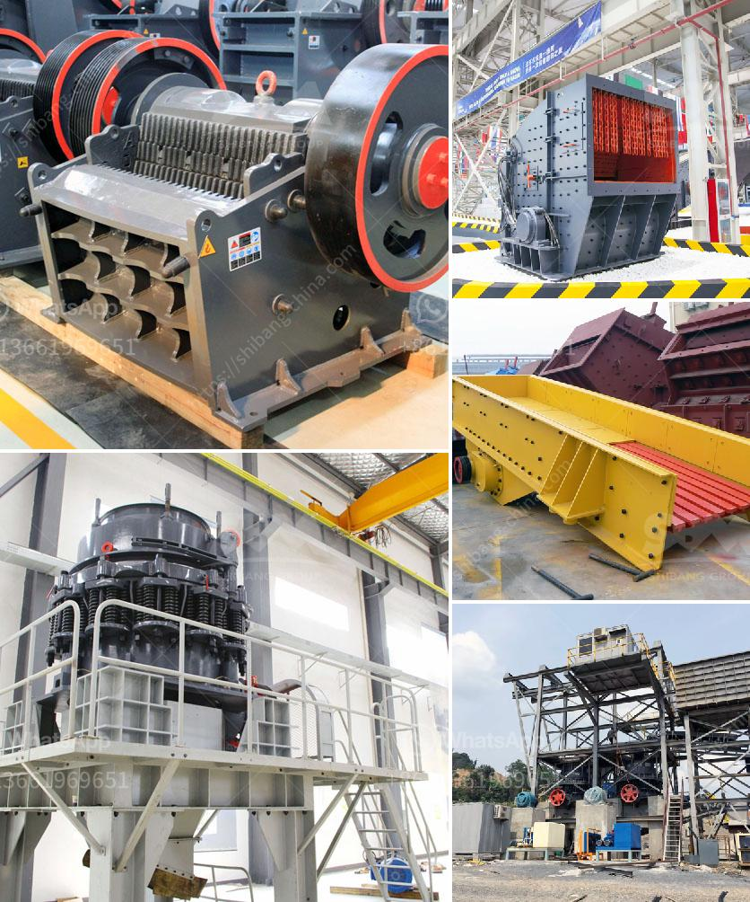

<h3>granite quarry crushing plant</h3>
Granite is largely used as a construction material across the globe. Its widespread availability, durability, and aesthetic appeal make it an ideal choice for various projects. One essential step in the process of turning granite into usable products is the granite quarry crushing plant. This article will briefly introduce the process and equipment used in a granite quarry crushing plant.

Crushing is the first stage in granite quarrying operation. The primary goal for a granite quarry crushing plant is to meet the required production requirements and achieve high reduction ratios. Many various types of crushing plants are developed for granite quarry crushing operations, such as jaw crusher, impact crusher, and cone crusher etc. As global supplier and manufacturer of crushing plants, SBM, provides complete range of quarry crushing plant in Kazakhstan, Philippines, Pakistan, India, South Africa, Brazil, UK, Nigeria etc.

Rock and crushed stone products generally are loosened by drilling and blasting and then are loaded by power shovel or front-end loader into large haul trucks that transport the material to the processing operations. Techniques used for extraction vary with the nature and location of the deposit. Processing operations may include crushing, screening, size classification, material handling and storage operations.

Crushing plant is an essential equipment in stone quarry operations. SBM is the world leading supplier and manufacturer of crushing plant, grinding mill and sand making machine. We provide high quality stone crushing plant for sale, such as jaw crusher, impact crusher, hammer crusher, gyratory crusher, cone crusher etc.

With various models, diverse capacities and different specifications of equipment, we can offer you tailor-made solutions for your project. In addition, we also have mobile crushing and screening plant for your choose. It is designed based on the client’s crushing needs and can eliminate the obstacles of crushing site and environment, providing clients with efficient and low-cost project operation equipment.

SBM experts optimize every details of mobile granite quarry crushing machine. These crushing plants are designed in simple and robust structure, and with the benefits of high efficiency, low energy cost, easy operation and maintenance and high return on investment. High-quality granite quarry crushing plant from SBM ensures reliable performance.

Moreover, with reasonable granite quarry crushing plant price, meticulous after-sales service and excellent equipment quality, our company successfully occupied the global marketplaces, enjoyed high reputation among customers. SBM granite quarry crushing plant for sale is your wise choice.

As a professional granite quarry crushing plant supplier, SBM has been dedicated in manufacturing and supplying crushing plant for more than 50 years. SBM always provides high-quality and efficient granite quarry crushing plant machines for clients. Moreover, SBM also can customize granite quarry crushing plant based on your requirements. Please chat online with us for more information.
<h3>Contact us</h3><ul><li><strong>Whatsapp:&nbsp;<a href="https://wa.me/8613661969651">+8613661969651</a></strong></li><li><a href="https://swt.shibang-china.com/?git&amp;zhl&amp;granite quarry crushing plant"><strong>Online Service(chat now)</strong></a></li></ul><h3>Related</h3><ul><li><a href='chromite ore beneficiation processing.md'>chromite ore beneficiation processing</a></li><li><a href='rental mesin stone crusher.md'>rental mesin stone crusher</a></li><li><a href='grinding media loading in ball mill machine.md'>grinding media loading in ball mill machine</a></li><li><a href='wet ball milling process.md'>wet ball milling process</a></li><li><a href='bentonite plant dimensions.md'>bentonite plant dimensions</a></li></ul>