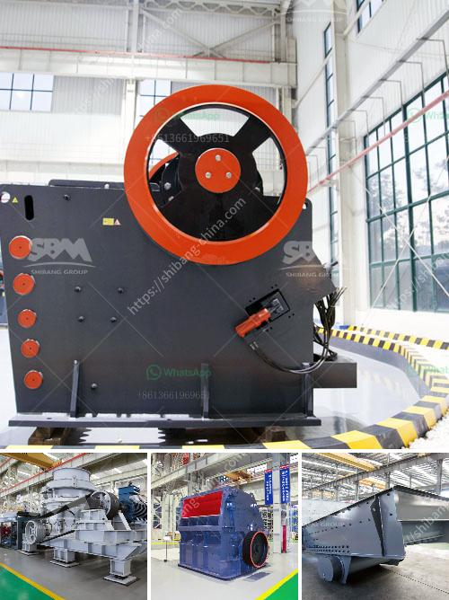

<h3>granite quarrying process</h3>
Granite, an igneous rock known for its durability and beauty, has been a highly sought-after material for thousands of years. From ancient Egyptian pyramids to modern-day skyscrapers, granite has stood the test of time. But have you ever wondered how this magnificent rock makes its way from the depths of the earth to your kitchen countertop or tombstone? Let's delve into the fascinating process of granite quarrying.

The journey of granite begins deep beneath the earth's crust, where molten material called magma cools and solidifies, forming large crystalline structures. Over millions of years, intense heat and pressure gradually push these granite deposits closer to the surface.

The first step in the granite quarrying process is locating the deposit. Geologists use advanced tools and techniques to explore the landscape and determine the presence and quality of granite deposits. Once a suitable site is identified, it's time to establish a quarry.

Quarrying is the method of extracting blocks or slabs of granite from the bedrock. The process begins with mining, where explosives are used to loosen the granite from its natural state. Huge drilling machines called jet-burners create vertical and horizontal holes, allowing for the placement of explosives.

After the controlled explosion, heavy-duty machinery, such as excavators and bulldozers, is employed to remove the debris and clear the area. This step requires careful handling, as any damage to the valuable granite blocks can significantly affect the quality and value of the final product.

Once the granite blocks are extracted, they are transported to a cutting facility for further processing. Here, skilled craftsmen use diamond-tipped wire saws, diamond-embedded circular saws, or high-pressure water jets to slice the blocks into manageable sizes. These cutting techniques ensure precision and minimize wastage, maximizing the yield of usable granite.

The cut slabs or blocks then undergo a series of treatments to refine, shape, and polish their surfaces. Rough edges are smoothed out and imperfections are removed using grinding and polishing machines. The level of polishing can vary depending on the desired finish, whether it's a high-gloss shine or a more natural, muted appearance.

Once the granite slabs are polished to perfection, they are ready to be transported and used in a variety of applications such as kitchen and bathroom countertops, flooring, wall cladding, gravestones, and architectural projects. The versatility of granite makes it a popular choice amongst designers, architects, and homeowners alike.

It's important to note that granite quarrying can have environmental impacts if not conducted responsibly. Dust, noise, and water pollution are some of the concerns associated with the quarrying process. However, many quarry operators are now adopting sustainable practices to minimize these impacts, such as implementing dust control measures, using water recycling systems, and restoring quarries to their natural state once operations cease.

Granite quarrying is a labor-intensive and intricate process that unveils the hidden beauty beneath the earth's surface. From the initial quarrying to the meticulous cutting and polishing, every step in the process contributes to the final product's quality and durability. So, the next time you admire the luxurious beauty of granite, remember the journey it undertook to adorn your living spaces and honor the craftsmanship behind this timeless material.
<h3>Contact us</h3><ul><li><strong>Whatsapp:&nbsp;<a href="https://wa.me/8613661969651">+8613661969651</a></strong></li><li><a href="https://swt.shibang-china.com/?git&amp;zhl&amp;granite quarrying process"><strong>Online Service(chat now)</strong></a></li></ul><h3>Related</h3><ul><li><a href='modeling of power mill ball.md'>modeling of power mill ball</a></li><li><a href='coal pulverizer machine.md'>coal pulverizer machine</a></li><li><a href='crusher unit and quarry land for sale.md'>crusher unit and quarry land for sale</a></li><li><a href='second hand stone crushing plants india.md'>second hand stone crushing plants india</a></li><li><a href='jaw crusher 10 x 36 sulit.md'>jaw crusher 10 x 36 sulit</a></li></ul>