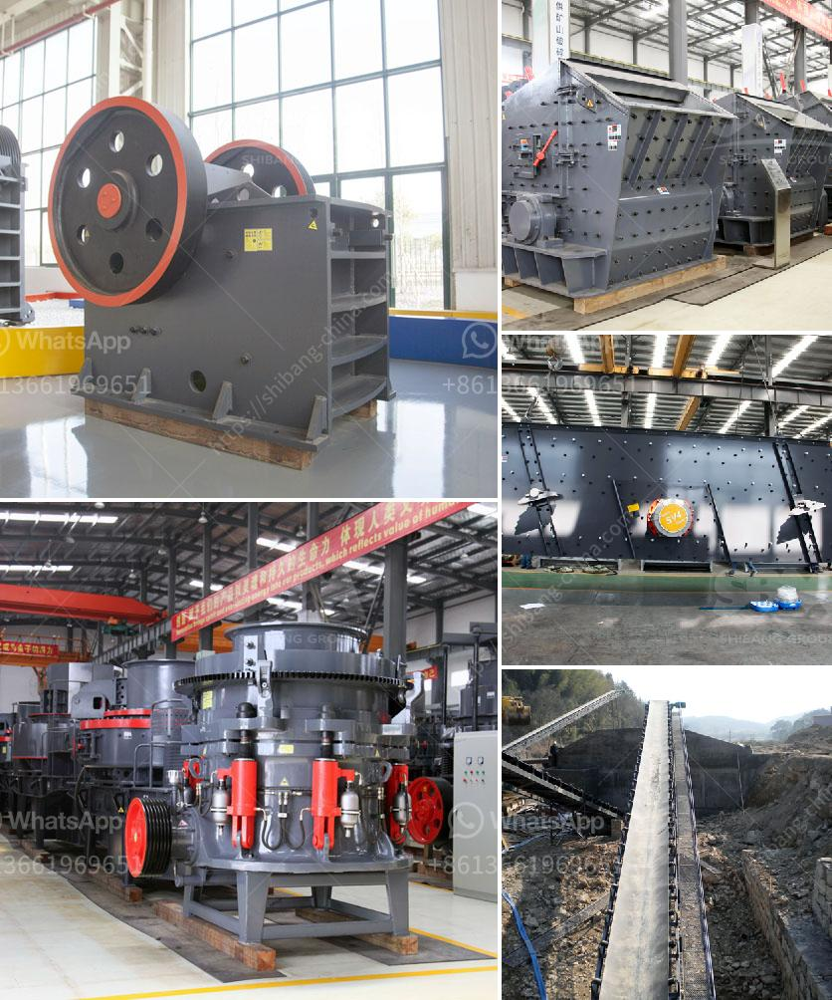

<h3>granite stone jaw crushers</h3>
Granite is one of the most widely used building materials in both residential and commercial construction projects. With numerous applications in countertops, flooring, and decorative pieces, it is essential to have high-quality granite stone jaw crushers that can crush and process this dense and durable stone efficiently.

Granite stone jaw crushers are renowned for their exceptional crushing capabilities and are primarily used for reducing large-sized stones into smaller sizes for further processing. They are known for their reliability, robust construction, and high productivity. This makes them the perfect choice for meeting different crushing requirements in various industries, including mining, construction, recycling, and more.

One of the key advantages of granite stone jaw crushers is their ability to crush materials of various hardness levels. From soft limestone to extremely hard granite, these crushers can tackle a wide range of materials without compromising on efficiency. With advanced technologies and innovative design features, these jaw crushers ensure optimal performance and reduced downtime.

Another significant feature of granite stone jaw crushers is their ease of use and maintenance. Many models come equipped with user-friendly controls and quick set-up options, allowing operators to quickly adjust the crusher settings as per the desired final product size. Additionally, the robust construction of these crushers ensures they are less prone to wear and tear, resulting in improved durability and extended lifespan.

The versatility of granite stone jaw crushers extends beyond their primary crushing capabilities. Many models come with integrated screens and conveyors, enabling them to produce multiple sizes of aggregates directly from the crusher. This eliminates the need for additional screening equipment, saving both time and costs.

In conclusion, granite stone jaw crushers offer numerous advantages for construction projects. Their ability to crush various materials, high productivity, and ease of use make them a valuable asset for any construction site. Whether you are working on a small renovation project or a large-scale construction site, investing in reliable granite stone jaw crushers can help you achieve efficient and cost-effective crushing operations.
<h3>Contact us</h3><ul><li><strong>Whatsapp:&nbsp;<a href="https://wa.me/8613661969651">+8613661969651</a></strong></li><li><a href="https://swt.shibang-china.com/?git&amp;zhl&amp;granite stone jaw crushers"><strong>Online Service(chat now)</strong></a></li></ul><h3>Related</h3><ul><li><a href='rental mesin stone crusher.md'>rental mesin stone crusher</a></li><li><a href='ball mill in mining.md'>ball mill in mining</a></li><li><a href='jaw crusher for sale kenya.md'>jaw crusher for sale kenya</a></li><li><a href='conveyor belts in peru.md'>conveyor belts in peru</a></li><li><a href='buy stone crushing machine in kenya.md'>buy stone crushing machine in kenya</a></li></ul>