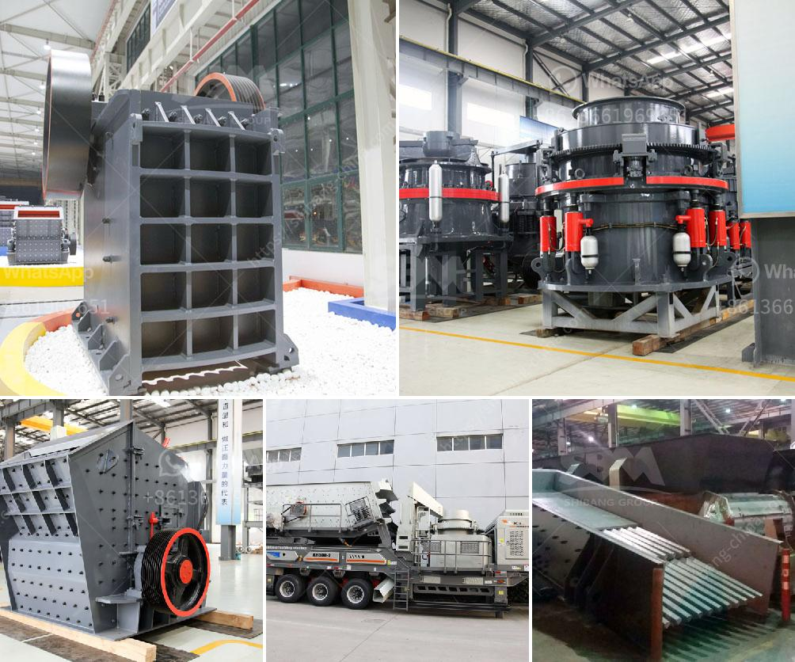

<h3>granite stones crusher</h3>
Granite is a common type of igneous rock that is granular in texture. Due to its high hardness and durability, it has become a popular material choice for construction projects. Crushers are essential equipment in mining and quarrying operations, as they break down large rocks into smaller, more manageable pieces.

One such piece of equipment is the granite stone crusher. As the name suggests, it is specifically designed to crush granite stones. This crusher can process materials up to 350mm in size, with a compression strength of up to 320MPa. It is suitable for crushing medium-hard materials, such as limestone, bluestone, and basalt.

The granite stone crusher consists of a crushing chamber, a rotor and a counter-attack plate. The equipment crushes various ores and rocks with compressive strength not exceeding 320MPa. It has the advantages of large crushing ratio, uniform product size, simple structure, reliable operation, and low operating cost.

The granite stone crusher is equipped with a direct hydraulic drive system that eliminates the need for a V-belt drive, reducing maintenance costs and improving equipment stability. Combined with the control system, the operator can easily adjust the discharge port, effectively control the size of the finished product, and ensure the stability of the granules.

In addition to its effectiveness in crushing granite, the stone crusher also excels in other applications. It is ideal for crushing basalt stones, as it provides high-quality aggregates for roads, railways, bridges, and airport runways. The crushed basalt can also be used for water filtration and purification systems.

Furthermore, a granite stone crusher is capable of crushing limestone, gypsum, and other rocks thanks to its efficient and reliable performance. The process is made easy with smaller particles and a certain uniformity in size. You can also use it to obtain high-quality sand for construction, asphalt, and concrete production.

When considering the purchase of a granite stone crusher, there are several key factors to take into account. The hardness, size, and moisture content of the material being crushed, as well as the desired final product size, should all be considered. Additionally, the availability of spare parts and after-sales support should also be taken into consideration.

In conclusion, a granite stone crusher is a practical and highly useful tool for construction productivity. Quality aggregates made possible by such crushing equipment enable the creation of high-quality projects, making them more durable and long-lasting. With its wide applications and reliable performance, the granite stone crusher has become a valued tool among construction professionals.
<h3>Contact us</h3><ul><li><strong>Whatsapp:&nbsp;<a href="https://wa.me/8613661969651">+8613661969651</a></strong></li><li><a href="https://swt.shibang-china.com/?git&amp;zhl&amp;granite stones crusher"><strong>Online Service(chat now)</strong></a></li></ul><h3>Related</h3><ul><li><a href='gypsum chromium limestone mining.md'>gypsum chromium limestone mining</a></li><li><a href='limestone treatment plant.md'>limestone treatment plant</a></li><li><a href='price conveyor belt.md'>price conveyor belt</a></li><li><a href='fly ash electrostatic separator manufacturer.md'>fly ash electrostatic separator manufacturer</a></li><li><a href='ton per day gold processing plant.md'>ton per day gold processing plant</a></li></ul>