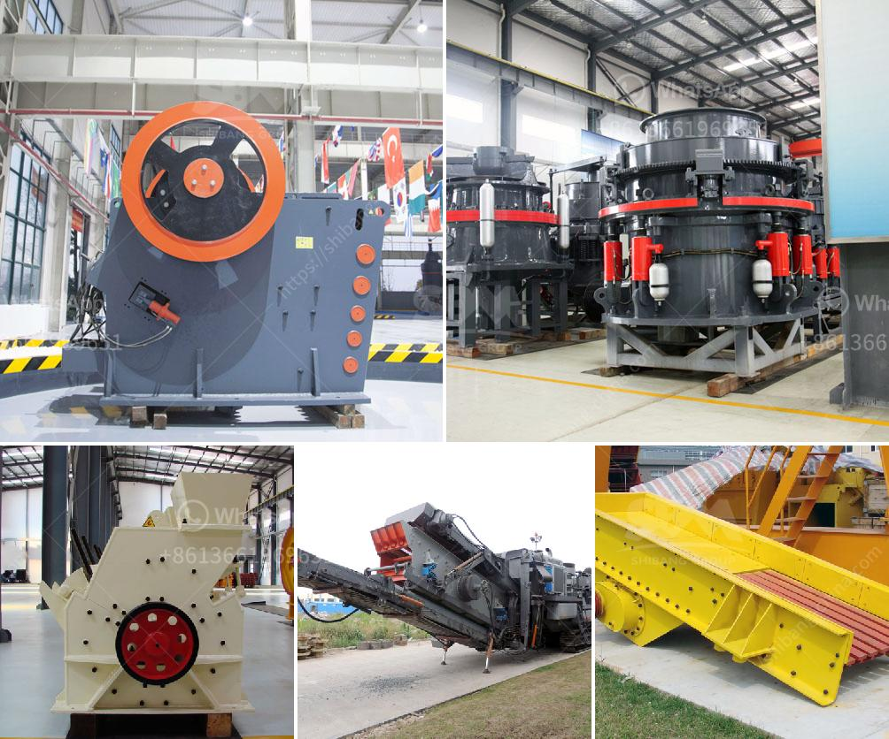

<h3>graphite ore buyers in india</h3>
India, a growing global economic power, boasts a robust industrial sector that drives its economic growth. One critical component in various industries, especially steel and automotive, is graphite ore. Graphite ore is an essential raw material used in the manufacturing of electrodes, lubricants, batteries, and other key industrial products.

In recent years, the demand for graphite ore in India has reached new heights due to increased industrialization, infrastructure development, and technological advancements. This surge in demand has created a thriving market for graphite ore buyers in India.

Graphite ore buyers in India play a pivotal role in the graphite supply chain. These buyers are actively engaged in the procurement of graphite ore from both domestic and international sources. They are responsible for ensuring a steady supply of high-quality graphite ore to meet the demands of the Indian market.

India, being one of the largest steel producers globally, requires a significant amount of graphite ore for steel production and other applications. Consequently, graphite ore buyers in India work closely with both domestic and international suppliers to secure a consistent supply of graphite ore.

Furthermore, with an increasing emphasis on renewable energy and electric vehicles, the demand for graphite ore has witnessed a significant upsurge. As a result, graphite ore buyers in India are actively searching for new suppliers and exploring partnerships to meet this surging demand. They are constantly evaluating different suppliers based on the quality, consistency, and cost-effectiveness of their graphite ore.

To ensure a smooth procurement process, graphite ore buyers in India often collaborate with experts and industry associations to navigate through the complexities of the market. They actively participate in trade fairs, seminars, and conferences to stay updated with the latest industry trends and network with potential suppliers.

In conclusion, India's growing industrial sector and its increasing reliance on graphite ore have created a lucrative market for graphite ore buyers in the country. These buyers play a crucial role in securing a steady supply of high-quality graphite ore to fuel India's economic growth and technological advancements. With the ongoing demand for graphite ore, these buyers are poised to expand their operations and explore new avenues for partnerships and collaborations in the coming years.
<h3>Contact us</h3><ul><li><strong>Whatsapp:&nbsp;<a href="https://wa.me/8613661969651">+8613661969651</a></strong></li><li><a href="https://swt.shibang-china.com/?git&amp;zhl&amp;graphite ore buyers in india"><strong>Online Service(chat now)</strong></a></li></ul><h3>Related</h3><ul><li><a href='mobile tracked crushers.md'>mobile tracked crushers</a></li><li><a href='ore grinding grinding mill china.md'>ore grinding grinding mill china</a></li><li><a href='primary crusher meaning in hindi.md'>primary crusher meaning in hindi</a></li><li><a href='stone crusher machinery china.md'>stone crusher machinery china</a></li><li><a href='ball mills in limpets.md'>ball mills in limpets</a></li></ul>