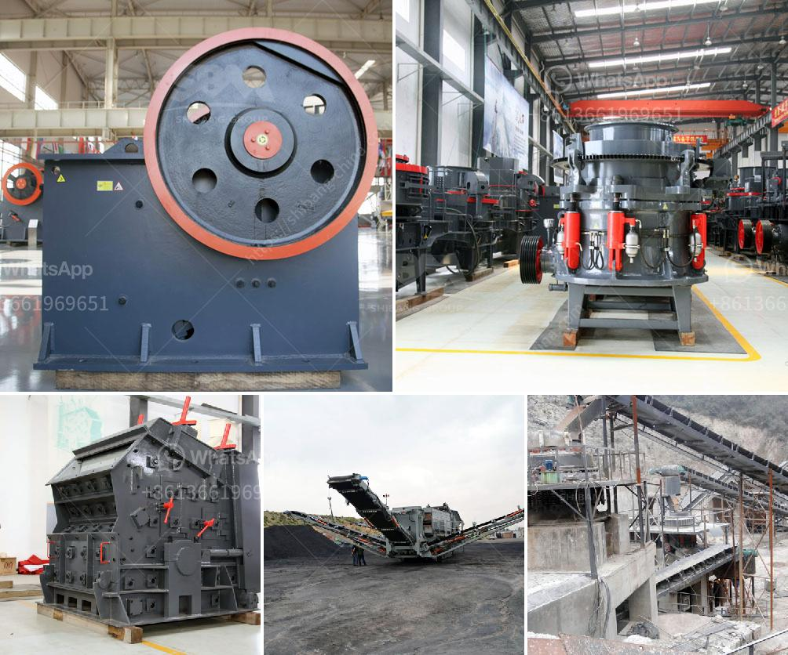

<h3>graphite processing equipment</h3>
Graphite is a naturally occurring form of carbon that has gained immense popularity in recent years due to its unique properties and wide range of applications. From smartphones and electric vehicle batteries to nuclear power plants and aerospace components, graphite has become a critical material for various industries. However, the extraction and processing of graphite require specialized equipment to ensure optimal quality and efficiency.

Graphite processing equipment plays a crucial role in transforming raw graphite into usable forms that meet the specific needs of different industries. There are several key processes involved in graphite processing, including crushing, grinding, flotation, and purification. Each of these processes requires specific equipment to achieve the desired results.

To begin with, graphite ore is usually extracted through open-pit mining or underground mining. Once the ore is extracted, it is typically crushed into smaller particles using crushers. Jaw crushers and cone crushers are commonly used in this initial crushing stage. These machines help to reduce the size of the graphite particles, making them easier to handle and further process.

Next, grinding equipment is used to further pulverize the crushed graphite into even finer particles. Ball mills and rod mills are often used for this purpose. These mills rotate, causing the graphite particles to be ground against each other or against the walls of the mill, resulting in the desired particle size reduction.

After grinding, the graphite particles need to be separated from impurities through a process called flotation. Flotation equipment, such as flotation cells and flotation columns, is utilized for this purpose. The graphite particles are mixed with water and chemicals, forming a froth that carries away the graphite while leaving behind impurities. The graphite froth is then collected and dried for further processing.

Purification is another crucial step in graphite processing. It involves removing any remaining impurities to achieve high-purity graphite. Different purification methods, such as acid leaching or thermal purification, may be used depending on the specific requirements of the end product. Specialized equipment, such as reactors, kilns, and furnaces, is employed in these purification processes.

In addition to the aforementioned processes, graphite processing equipment also encompasses machinery for shaping and molding graphite into the desired forms required by different applications. This includes equipment like extruders, presses, and 3D printers, which enable the production of graphite rods, sheets, blocks, and custom components.

Overall, graphite processing equipment plays a vital role in transforming raw graphite into usable forms. By employing specialized machinery for crushing, grinding, flotation, purification, and shaping, the efficiency and quality of graphite processing can be greatly enhanced. The importance of graphite processing equipment cannot be overstated, as it directly impacts the performance and functionality of the end products used in various industries. As the demand for graphite continues to rise due to its unique properties and versatility, the development and advancement of graphite processing equipment will remain critical to ensuring a sustainable supply of high-quality graphite materials.
<h3>Contact us</h3><ul><li><strong>Whatsapp:&nbsp;<a href="https://wa.me/8613661969651">+8613661969651</a></strong></li><li><a href="https://swt.shibang-china.com/?git&amp;zhl&amp;graphite processing equipment"><strong>Online Service(chat now)</strong></a></li></ul><h3>Related</h3><ul><li><a href='river sand washing machine.md'>river sand washing machine</a></li><li><a href='total cost of stone crushing unit in india.md'>total cost of stone crushing unit in india</a></li><li><a href='4 raymond roller mill.md'>4 raymond roller mill</a></li><li><a href='stone crusher nigeria.md'>stone crusher nigeria</a></li><li><a href='large capacity jaw crusher machines sales to india.md'>large capacity jaw crusher machines sales to india</a></li></ul>