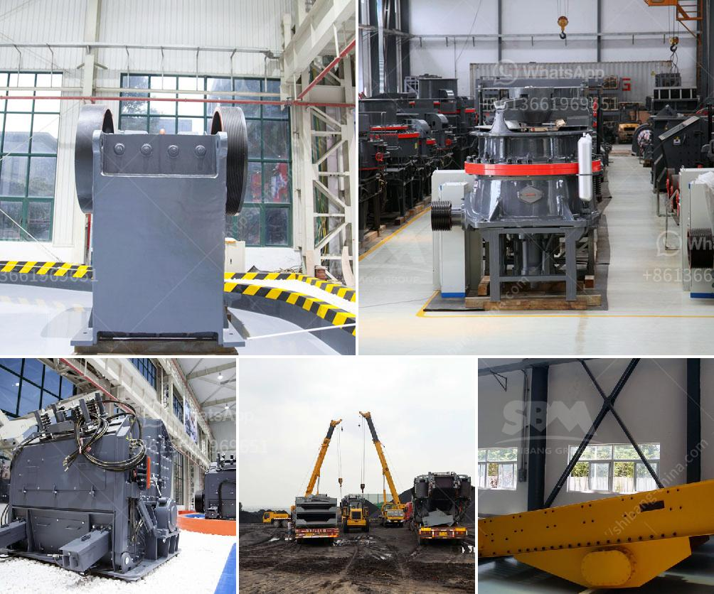

<h3>graphite processing flowsheet</h3>
Graphite is a versatile mineral that has various industrial applications due to its unique properties. It is a form of carbon that exhibits excellent thermal and electrical conductivity, high strength and stiffness, low friction, and chemical inertness. One of the key steps in utilizing graphite is processing it into a usable form that meets specific industrial requirements. In this article, we will explore the general flowsheet for graphite processing.

The first step in graphite processing is ore preparation, where the raw ore is crushed, ground, and classified into different size fractions. This is done to remove impurities and achieve the desired particle size distribution. The ore is typically crushed using jaw or gyratory crushers, and then further ground with ball mills or rod mills. The ground ore is then subjected to classification processes such as screening or cyclones to separate the different size fractions.

Once the ore is properly prepared, it undergoes a series of physical and chemical treatments to improve its purity and enhance its properties. The most common method for purification is flotation, where the ore is mixed with water and a variety of chemicals to create a froth that selectively attaches to graphite particles. This allows the graphite to be separated from other minerals in the ore.

After flotation, the graphite concentrate is subjected to further treatment to remove impurities and achieve the desired purity level. This usually involves processes such as acid leaching, thermal treatment, or chemical purification using reagents like hydrofluoric acid. Each method has its own advantages and drawbacks, and the choice depends on the specific requirements of the end application.

Once the graphite concentrate is purified, it can be further processed into different forms based on the intended application. One common form is flake graphite, which is used in industries such as lubricants, batteries, and refractories. Flake graphite is typically produced by mechanically crushing and grinding the concentrate into a fine powder.

Another form of graphite is synthetic graphite, which is produced by heating high-quality carbon precursors such as petroleum coke or coal tar pitch to temperatures of around 2500 to 3000 degrees Celsius in a process called graphitization. This transforms the amorphous carbon into a highly crystalline graphite structure with exceptional properties.

In addition to flake and synthetic graphite, there are other forms such as expandable graphite and spherical graphite, which have their own unique processing methods. Expandable graphite is produced by treating flake graphite with intercalation chemicals, which cause the graphite layers to separate and expand upon heating. This results in a material with increased volume and improved fire retardant properties. Spherical graphite, on the other hand, is produced by milling flake graphite into small spherical particles, which are then used as anode material in lithium-ion batteries.

In conclusion, the processing of graphite involves several steps to transform crude ore into a usable form with the desired properties. From ore preparation and purification to final product production, the flowsheet can vary based on the specific needs of different industries. Graphite processing plays a crucial role in enabling the utilization of this versatile mineral and unlocking its full potential in various applications.
<h3>Contact us</h3><ul><li><strong>Whatsapp:&nbsp;<a href="https://wa.me/8613661969651">+8613661969651</a></strong></li><li><a href="https://swt.shibang-china.com/?git&amp;zhl&amp;graphite processing flowsheet"><strong>Online Service(chat now)</strong></a></li></ul><h3>Related</h3><ul><li><a href='price list jaw crusher 150 x 200mm.md'>price list jaw crusher 150 x 200mm</a></li><li><a href='clinker grinding unit prices.md'>clinker grinding unit prices</a></li><li><a href='gravel crusher for sale.md'>gravel crusher for sale</a></li><li><a href='diagram of coal conveyor tunnel.md'>diagram of coal conveyor tunnel</a></li><li><a href='roller mill spaider.md'>roller mill spaider</a></li></ul>