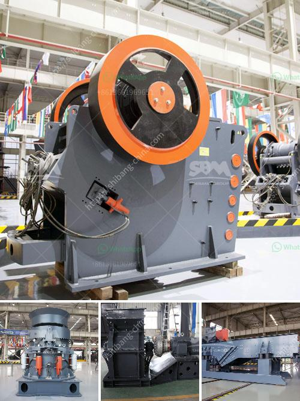

<h3>gravel crusher for sale</h3>
When it comes to construction and landscaping projects, gravel is often a key component. Gravel is a mixture of crushed rock and sand, which can either be obtained naturally or through crushing large rocks. One common use for gravel is in the production of concrete and asphalt. With the increasing demand for these materials, gravel crushers have become increasingly popular.

A gravel crusher is a machine specially designed to crush large rocks into smaller rocks, gravel, or rock dust. This is ideal for landscapers, as it creates gravel that can be used in various construction projects, such as patios, driveways, sidewalks, and even foundations.

There are several benefits to using a gravel crusher. Firstly, it significantly reduces the costs and time associated with traditional methods of crushing rocks. Instead of hiring multiple workers and using heavy machinery, a single individual can operate a gravel crusher and efficiently produce the desired gravel size needed for a particular project. This can save both time and money.

Additionally, gravel crushers are highly versatile. They can produce various sizes of gravel depending on the specific job requirements. Whether you need a fine gravel for a garden pathway or a larger size for a driveway, a gravel crusher can easily adjust to meet your needs. This flexibility makes it a valuable tool for both professional contractors and DIY enthusiasts.

Another advantage of using a gravel crusher is that it helps to create a more sustainable environment. By crushing large rocks into smaller ones, gravel crushers can effectively recycle materials that would otherwise end up in landfills. This reduces the carbon footprint associated with mining new materials and helps to conserve natural resources.

Furthermore, gravel crushers are relatively easy to maintain. They consist of basic mechanical components and do not require extensive knowledge or special training to operate. Regular check-ups, lubrication, and cleaning are typically all that is needed to keep a gravel crusher in good working order.

If you are considering purchasing a gravel crusher, it is important to choose the right type for your specific needs. Several factors should be taken into account, such as the size and type of rocks you will be crushing, the production capacity required, and any additional features you may need, such as a screening mechanism.

When browsing for a gravel crusher for sale, it is recommended to consult with a trusted seller or manufacturer who can provide you with the necessary information and guidance to make an informed decision. They can help you select the right model and ensure that it is compatible with your existing equipment and infrastructure.

In conclusion, a gravel crusher for sale is an essential piece of equipment for large-scale construction projects and landscaping endeavors. Its versatile nature allows it to produce gravel of various sizes, making it a valuable asset in the construction industry. Furthermore, the use of a gravel crusher helps to reduce waste and promote sustainability. When properly maintained, a gravel crusher can be a reliable and efficient tool for any construction or landscaping project.
<h3>Contact us</h3><ul><li><strong>Whatsapp:&nbsp;<a href="https://wa.me/8613661969651">+8613661969651</a></strong></li><li><a href="https://swt.shibang-china.com/?git&amp;zhl&amp;gravel crusher for sale"><strong>Online Service(chat now)</strong></a></li></ul><h3>Related</h3><ul><li><a href='quartz processing plant.md'>quartz processing plant</a></li><li><a href='stone powder making machine in india.md'>stone powder making machine in india</a></li><li><a href='grinding media loading in ball mill machine.md'>grinding media loading in ball mill machine</a></li><li><a href='cost of 5 000 tpd cement project ore processing.md'>cost of 5 000 tpd cement project ore processing</a></li><li><a href='stone crusher machine plant for sale in pakistan.md'>stone crusher machine plant for sale in pakistan</a></li></ul>