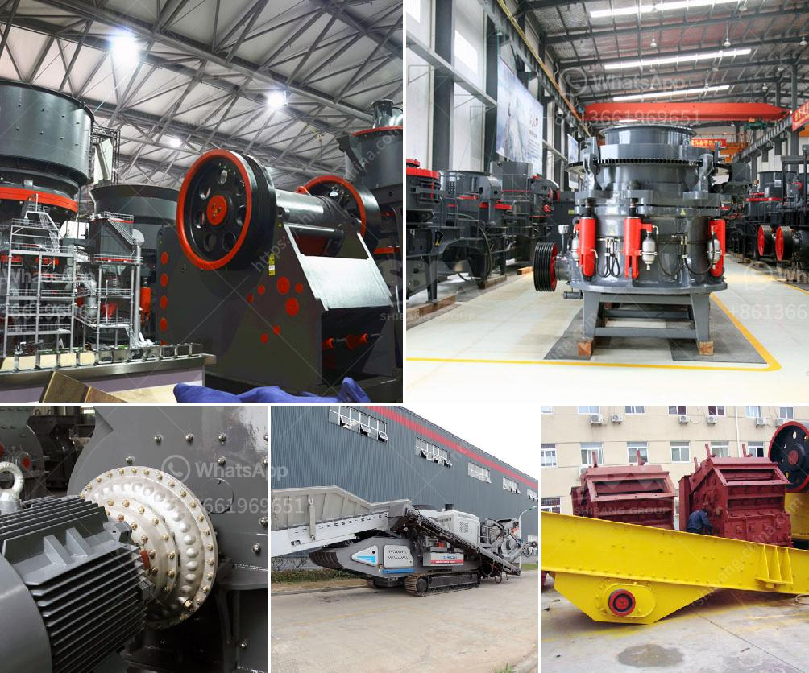

<h3>gravel jaw crusher</h3>
Gravel is composed of various rocks and minerals, making it a versatile and essential material in construction, landscaping, and road infrastructure projects. To meet the ever-increasing demand for gravel, the use of a gravel jaw crusher is crucial in crushing and processing the gravel.

A gravel jaw crusher is a machine designed to crush rock into smaller pieces. It can be used to build roads, highways, residential and commercial projects, as well as for various applications in the mining and construction industries. The versatility of this crusher allows it to crush a wide range of materials, including granite, basalt, limestone, and more.

One of the key advantages of a gravel jaw crusher is its capability to crush rocks with high hardness levels. The powerful and robust design of the crusher ensures that it can handle even the toughest materials, providing a reliable and efficient crushing solution. Moreover, the adjustable jaw settings enable the crusher to produce various sizes of gravel, catering to the specific needs of different projects.

In addition to its powerful crushing capabilities, a gravel jaw crusher is also known for its low operating costs. The energy-efficient motor and advanced technology used in the crusher result in reduced energy consumption, making it an environmentally-friendly choice. The durable components and minimal maintenance requirements of the crusher contribute to its cost-effectiveness, saving both time and money in the long run.

Furthermore, a gravel jaw crusher is designed for easy transportation and installation. It can be quickly moved from one site to another, allowing for efficient material processing in multiple locations. The compact size and user-friendly features of the crusher make it an ideal choice for contractors and quarry operators who need a mobile crushing solution.

In conclusion, a gravel jaw crusher is a reliable and efficient crushing machine that plays a key role in the processing of gravel. It offers various benefits to construction, mining, and quarrying industries, making it an essential piece of equipment for gravel production. With its powerful crushing capabilities, low operating costs, and easy transportation, a gravel jaw crusher is a valuable investment for any gravel processing operation.
<h3>Contact us</h3><ul><li><strong>Whatsapp:&nbsp;<a href="https://wa.me/8613661969651">+8613661969651</a></strong></li><li><a href="https://swt.shibang-china.com/?git&amp;zhl&amp;gravel jaw crusher"><strong>Online Service(chat now)</strong></a></li></ul><h3>Related</h3><ul><li><a href='gold ore processing equipment manufacturer.md'>gold ore processing equipment manufacturer</a></li><li><a href='copper ore crushing plant in chile.md'>copper ore crushing plant in chile</a></li><li><a href='used crusher for sale in south africa.md'>used crusher for sale in south africa</a></li><li><a href='aggregate production process.md'>aggregate production process</a></li><li><a href='mobile rock crushers in ghana.md'>mobile rock crushers in ghana</a></li></ul>