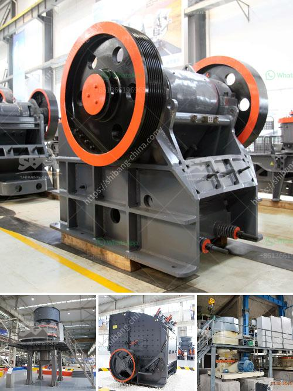

<h3>gravel wash plant homemade</h3>
In the construction and mining industries, high-quality materials are essential for the success of any project. When it comes to gravel, having clean, well-graded, and properly washed material is crucial. This is where a gravel wash plant can be a game-changer. While there are many options available in the market, building a homemade gravel wash plant can be a cost-effective and efficient solution.

A gravel wash plant is a machine used to separate and clean particles of different sizes from one another. It takes in raw gravel, feeds it into a series of screens with varying mesh sizes, and directs the material onto conveyors for further processing. The washed gravel is then ready for use in construction and other applications.

Building a homemade gravel wash plant may sound like a daunting task, but it can be done with the right tools, materials, and a little bit of know-how. Here's a step-by-step guide to get you started:

1. Design and Planning: Begin by designing your wash plant layout. Consider factors like available space, water supply, and power source. Sketch out the layout, including the number and sizes of screens, conveyors, and other necessary components.

2. Gathering Materials: To build your homemade wash plant, you will need a variety of materials. Some essential items include steel or aluminum frame, screens of different mesh sizes, conveyor belts, water supply system, and electrical components. Visit local hardware stores or order online to gather all the required materials.

3. Assembly: Start by constructing the frame for your wash plant. Use sturdy materials and secure all joints properly. Attach the screens to the frame, ensuring they can be easily changed or removed for maintenance. Install conveyor belts and connect them to a power source. Design and build a water supply system that allows for efficient washing of gravel.

4. Testing and Improvements: Once your homemade gravel wash plant is assembled, conduct thorough testing to ensure all components are working correctly. Monitor the efficiency of the system and make any necessary adjustments or improvements. Consider installing additional features like a fine material screw washer or a water recycling system for enhanced performance.

One of the significant advantages of building your homemade gravel wash plant is the cost savings. Purchasing a ready-made wash plant is a significant investment, while building one yourself can be much more affordable. By sourcing materials locally and repurposing certain components, you can build an effective wash plant at a fraction of the cost.

Another benefit is the ability to customize your wash plant according to your specific requirements. You have full control over the design and can tailor it to meet the needs of your projects. You can also incorporate design choices that prioritize environmental friendliness, such as using recyclable materials or implementing water-saving features.

In conclusion, a homemade gravel wash plant can be a cost-effective and efficient solution for obtaining high-quality materials. With proper planning, gathering materials, and assembly, you can build a wash plant that meets your needs while saving money. Remember to test, fine-tune, and make any necessary improvements to optimize the performance of your homemade wash plant.
<h3>Contact us</h3><ul><li><strong>Whatsapp:&nbsp;<a href="https://wa.me/8613661969651">+8613661969651</a></strong></li><li><a href="https://swt.shibang-china.com/?git&amp;zhl&amp;gravel wash plant homemade"><strong>Online Service(chat now)</strong></a></li></ul><h3>Related</h3><ul><li><a href='aggregate crusher production equipment.md'>aggregate crusher production equipment</a></li><li><a href='china quarry crushing production line equipment.md'>china quarry crushing production line equipment</a></li><li><a href='ball mill feed spout sale.md'>ball mill feed spout sale</a></li><li><a href='old used coal washing plants.md'>old used coal washing plants</a></li><li><a href='hammer crusher german made.md'>hammer crusher german made</a></li></ul>