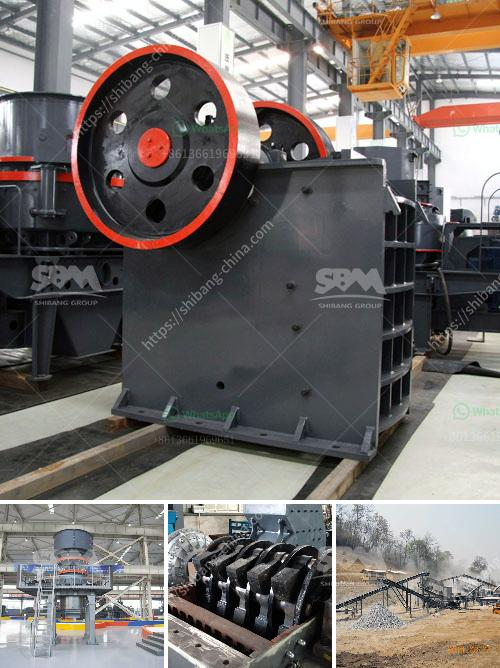

<h3>gravity gold recovery mill</h3>
Gravity gold recovery mills are a crucial part of the gold mining industry. With gold deposits becoming increasingly scarce, miners are turning to gravity concentration methods to recover gold from ore. These gravity mills use the force of gravity to separate valuable minerals from the surrounding rock, allowing for efficient and cost-effective gold extraction.

Gravity gold recovery mills operate on the principle that heavier particles will settle more quickly than lighter particles when in a slurry. Gold ore is crushed and ground into a fine powder, mixed with water and chemicals, and then fed into the gravity mill. The mill contains a series of troughs, or concentrators, which are equipped with riffles or grooves along the bottom. These riffles create turbulent flow that helps separate heavier particles from lighter particles.

As the slurry moves through the gravity mill, gold particles will settle into the troughs while lighter particles, including gangue minerals, will be carried away by the flowing water. The gold particles are then collected and further processed to extract the gold from the ore.

The efficiency of a gravity gold recovery mill depends on various factors, including the size and shape of the gold particles, the viscosity of the slurry, the flow rate of the water, and the angle and length of the troughs. The design and operation of the mill must be optimized to ensure maximum recovery of gold.

One of the advantages of gravity gold recovery mills is their simplicity and reliability. Unlike other gold separation methods that require complex equipment and processes, gravity mills are relatively straightforward to operate and maintain. They also have a smaller environmental footprint compared to methods that use chemicals, such as cyanide leaching.

Gravity gold recovery mills can be operated in different configurations, depending on the specific needs of the mine. Some mills are standalone units, while others are part of a larger processing plant. Some mills may require additional equipment, such as crushers or screens, to ensure that the ore is properly sized before entering the mill. The throughput capacity of a gravity mill can vary depending on its size and configuration, but mills typically process several tons of ore per hour.

In conclusion, gravity gold recovery mills are essential for the gold mining industry, allowing miners to efficiently extract gold from ore using the force of gravity. These mills are reliable and environmentally friendly, making them a popular choice for gold recovery. As gold deposits become scarcer and more difficult to access, gravity mills will continue to play a vital role in the gold mining industry.
<h3>Contact us</h3><ul><li><strong>Whatsapp:&nbsp;<a href="https://wa.me/8613661969651">+8613661969651</a></strong></li><li><a href="https://swt.shibang-china.com/?git&amp;zhl&amp;gravity gold recovery mill"><strong>Online Service(chat now)</strong></a></li></ul><h3>Related</h3><ul><li><a href='limestone mill for fertilizer.md'>limestone mill for fertilizer</a></li><li><a href='300 tph cone crusher price.md'>300 tph cone crusher price</a></li><li><a href='cost of a conveyor belt systems for mining.md'>cost of a conveyor belt systems for mining</a></li><li><a href='1000 ton crusher.md'>1000 ton crusher</a></li><li><a href='bauxite mining process flow chart germany.md'>bauxite mining process flow chart germany</a></li></ul>