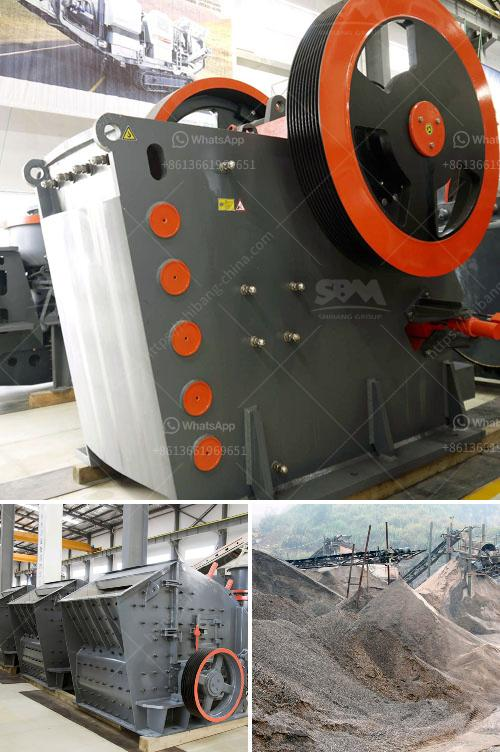

<h3>grinder machine for fine powder</h3>
Grinder machines are widely used in the manufacturing and processing industries to crush or grind various materials into fine powders. One such machine that is commonly used is the grinder machine for fine powder. This machine is capable of grinding materials into a very fine powder, which is ideal for numerous applications.

The grinder machine for fine powder works by feeding larger materials into the grinding chamber, where it is pulverized into small particles by a series of rotating blades. These blades are commonly made of stainless steel, ensuring durability and resistance to wear. As the materials are continuously fed into the machine, the fine powder is discharged from the bottom, ready for further processing or packaging.

One of the key advantages of using a grinder machine for fine powder is its versatility. It can handle a wide range of materials, including but not limited to minerals, pharmaceuticals, chemicals, food ingredients, and more. This makes it an essential tool in various industries, such as pharmaceutical manufacturing, food processing, and even the cosmetic industry.

The grinder machine for fine powder also offers precise control over the size of the particles produced. By adjusting the speed and the clearance between the blades, operators can achieve the desired fineness of the powder. This level of control ensures consistency throughout the grinding process, which is crucial for maintaining product quality and meeting specific requirements.

Furthermore, the grinder machine for fine powder is designed to operate efficiently, minimizing energy consumption. Its robust construction and high-quality components contribute to its reliability, reducing downtime and maintenance costs. It is also equipped with safety features to protect operators and prevent accidents during operation.

In conclusion, the grinder machine for fine powder is a valuable tool in various industries, allowing manufacturers to process materials into fine powders with precision and efficiency. Its versatility, control over particle size, and energy efficiency make it an essential piece of equipment for many manufacturing and processing operations.
<h3>Contact us</h3><ul><li><strong>Whatsapp:&nbsp;<a href="https://wa.me/8613661969651">+8613661969651</a></strong></li><li><a href="https://swt.shibang-china.com/?git&amp;zhl&amp;grinder machine for fine powder"><strong>Online Service(chat now)</strong></a></li></ul><h3>Related</h3><ul><li><a href='limestone processing plant.md'>limestone processing plant</a></li><li><a href='vertical roller mill maintenance pdf.md'>vertical roller mill maintenance pdf</a></li><li><a href='aggregate crushing plant price.md'>aggregate crushing plant price</a></li><li><a href='basalt crushing machinery processing line.md'>basalt crushing machinery processing line</a></li><li><a href='simple stone crushers kenya.md'>simple stone crushers kenya</a></li></ul>