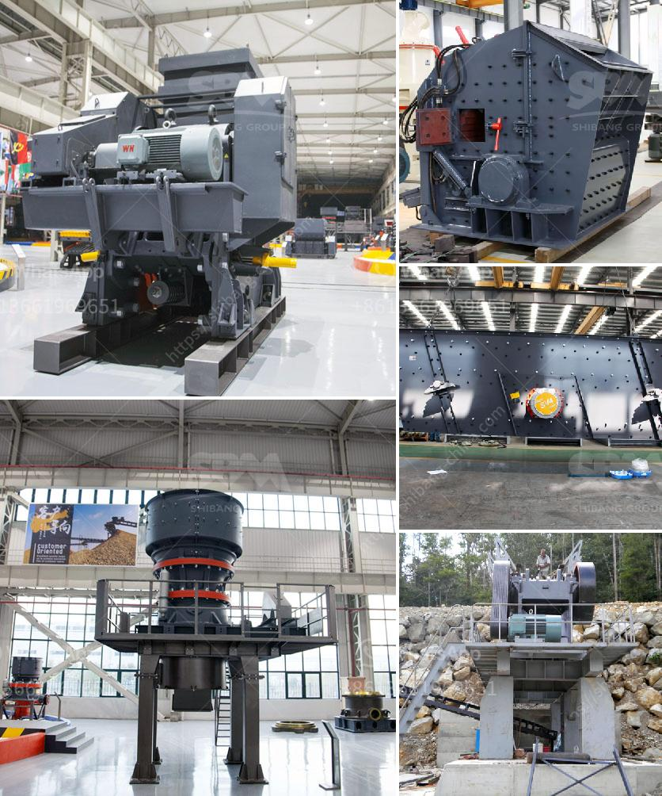

<h3>grinding and milling machines</h3>
Grinding and milling machines are essential tools in the manufacturing industry, where they are utilized for various machining purposes. These machines are commonly used for shaping, forming, and cutting metals or other materials that need precision and accuracy.

Grinding machines are designed to remove excess material from a workpiece by abrasion. They utilize an abrasive wheel or belt to achieve this, creating a smooth and refined finish on the surface. With different types of grinding machines available, such as cylindrical, surface, and centerless grinders, manufacturers can achieve precise results that meet their specific requirements.

Milling machines, on the other hand, are used for cutting and shaping solid materials into the desired shapes and sizes. These machines remove material from a workpiece using rotary cutters and can perform various cutting operations, including drilling, reaming, and threading. With computer numerical control (CNC) milling machines, manufacturers can program precise movements and create complex shapes with high accuracy and efficiency.

Both grinding and milling machines are incredibly versatile and can be used for a wide range of applications. In the automotive industry, these machines are used for manufacturing components like engine parts, gears, and brake discs. In the aerospace industry, they are crucial for shaping aircraft components with precision. Additionally, the medical and dental fields heavily rely on these machines for the production of prosthetics and dental implants.

The advancements in technology have significantly enhanced the capabilities of grinding and milling machines. CNC technology has allowed manufacturers to automate the machining process, resulting in higher productivity and accuracy. Additionally, these machines now feature advanced software programs that enable operators to control and monitor the machining process more efficiently.

In conclusion, grinding and milling machines are indispensable tools in the manufacturing industry. From shaping and cutting to achieving precision finishes, these machines play a crucial role in producing high-quality components. With continuous advancements in technology, the future of these machines looks promising, further improving productivity, efficiency, and the overall quality of machined products.
<h3>Contact us</h3><ul><li><strong>Whatsapp:&nbsp;<a href="https://wa.me/8613661969651">+8613661969651</a></strong></li><li><a href="https://swt.shibang-china.com/?git&amp;zhl&amp;grinding and milling machines"><strong>Online Service(chat now)</strong></a></li></ul><h3>Related</h3><ul><li><a href='calcium carbonate milling plant in turkey.md'>calcium carbonate milling plant in turkey</a></li><li><a href='ball mill work rules.md'>ball mill work rules</a></li><li><a href='stones crushing into building sand.md'>stones crushing into building sand</a></li><li><a href='manufacturing from stone machine.md'>manufacturing from stone machine</a></li><li><a href='stone crusher machine price in usa.md'>stone crusher machine price in usa</a></li></ul>