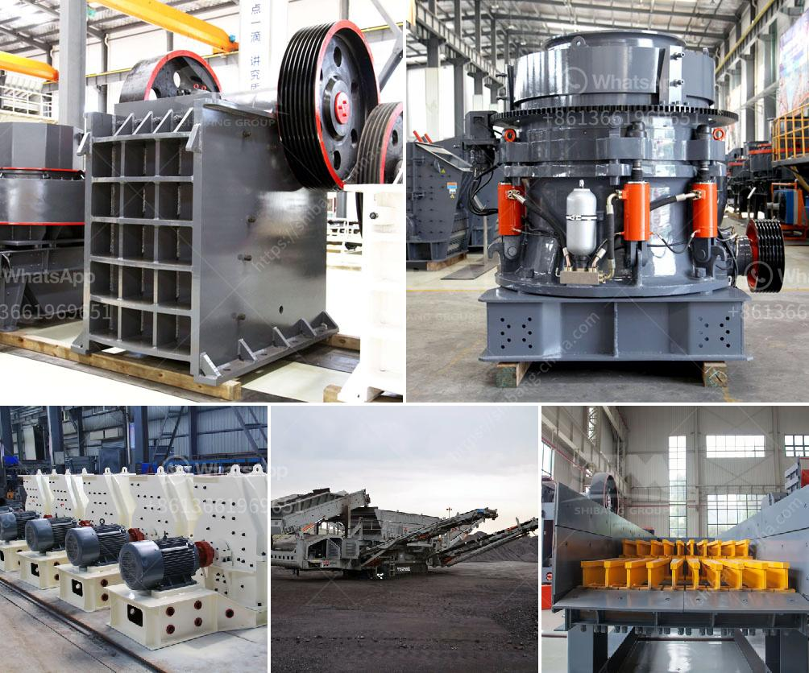

<h3>grinding cost calculation for bm 8 usha mill</h3>
Grinding mills play a crucial role in various industrial processes, as they are responsible for reducing the size of different materials to make them suitable for further processing. One such mill widely used in the industry is the BM 8 Usha Mill.

To determine the grinding cost for the BM 8 Usha Mill, several factors need to be considered. Firstly, the input material and its characteristics play a significant role. The hardness, moisture content, and size of the material can affect the grinding process and subsequently the cost. Harder materials may require more energy and time for grinding, thereby increasing the overall cost.

Additionally, the required fineness of the output material must be taken into account. Different applications demand different particle sizes, and achieving the desired fineness can impact the grinding cost. Finer materials generally require more grinding time and energy, resulting in higher costs.

Another critical factor is the machine parameters, including the speed of the mill and the grinding media used. The chosen operating parameters can significantly influence the cost calculation. The speed should be chosen carefully to optimize the grinding process and minimize energy consumption. Similarly, the selection of grinding media affects both the efficiency and cost, as different media have varying wear rates and performance characteristics.

Maintenance and operating costs must also be considered. Regular maintenance and proper operation ensure efficient grinding and prolong the lifespan of the equipment. Neglecting these aspects can lead to increased downtime, decreased productivity, and additional expenses.

Overall, calculating the grinding cost for the BM 8 Usha Mill involves considering input material characteristics, required fineness, machine parameters, and maintenance costs. Additionally, it is crucial to analyze the production requirements and the economic viability of the grinding process to make informed decisions.

In conclusion, understanding the various factors involved in grinding cost calculation is vital for optimizing the performance and cost-effectiveness of the BM 8 Usha Mill. Accurate cost calculations help industries plan and allocate resources efficiently, leading to improved productivity and profitability.
<h3>Contact us</h3><ul><li><strong>Whatsapp:&nbsp;<a href="https://wa.me/8613661969651">+8613661969651</a></strong></li><li><a href="https://swt.shibang-china.com/?git&amp;zhl&amp;grinding cost calculation for bm 8 usha mill"><strong>Online Service(chat now)</strong></a></li></ul><h3>Related</h3><ul><li><a href='smill grinding mill machine price.md'>smill grinding mill machine price</a></li><li><a href='jaw crusher part diagram.md'>jaw crusher part diagram</a></li><li><a href='used rock roll crusher.md'>used rock roll crusher</a></li><li><a href='ore grinding grinding mill china.md'>ore grinding grinding mill china</a></li><li><a href='stone crushing industry tanzania.md'>stone crushing industry tanzania</a></li></ul>