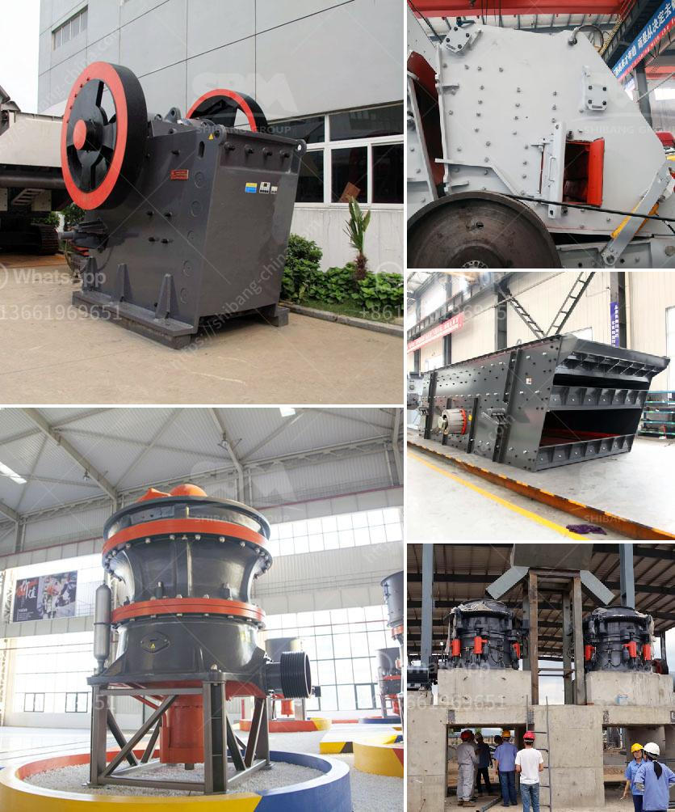

<h3>grinding equipment and machinery</h3>
In the fast-paced world of industrial manufacturing, fine-tuning operations to achieve faster, more efficient results is crucial. One such revolutionary tool that has transformed the way industrial grinding processes are carried out is grinding equipment and machinery. These advanced machines have become an integral part of various industries, enabling companies to achieve high precision and productivity.

Grinding equipment and machinery are designed to remove material from a workpiece by abrasion, resulting in a smooth and polished surface. From shaping and finishing metals to grinding tough materials, these machines offer diverse functionality and are used in industries such as automotive, aerospace, construction, and even the medical field.

One of the compelling advantages of grinding equipment and machinery is their ability to deliver precise and reliable results. These machines utilize abrasive wheels or belts that rotate at high speeds, allowing for precise material removal with minimal errors. This level of accuracy ensures consistent quality, particularly when manufacturing parts or components that require tight tolerances.

Moreover, grinding equipment and machinery have significantly reduced the time and effort required for grinding processes. Manual grinding can often be labor-intensive and time-consuming, leading to lower productivity. With these advanced machines, productivity can be maximized as they offer automated features and quick setup, minimizing downtime and enhancing overall efficiency.

Companies worldwide are now investing in grinding equipment and machinery to address the increasing demand for high-quality products. Manufacturers can now achieve smooth, precise finishes in shorter periods, resulting in faster production and improved customer satisfaction.

However, it is essential to highlight that proper maintenance and safety precautions must be adhered to when using grinding equipment and machinery. Regular inspections, ensuring operators are well-trained, and using reliable protective gear are essential to prevent accidents and maintain the longevity of these machines.

In conclusion, grinding equipment and machinery have transformed industrial processes by providing precision, productivity, and efficiency. These advanced tools have become indispensable for various manufacturing sectors, helping them meet tight deadlines, improve product quality, and increase customer satisfaction. As technology continues to evolve, grinding equipment and machinery will adapt to meet the ever-growing demands of an ever-changing industrial landscape.
<h3>Contact us</h3><ul><li><strong>Whatsapp:&nbsp;<a href="https://wa.me/8613661969651">+8613661969651</a></strong></li><li><a href="https://swt.shibang-china.com/?git&amp;zhl&amp;grinding equipment and machinery"><strong>Online Service(chat now)</strong></a></li></ul><h3>Related</h3><ul><li><a href='how much does it cost to open a crusher stone plant.md'>how much does it cost to open a crusher stone plant</a></li><li><a href='mining calcium carbonate vietnam.md'>mining calcium carbonate vietnam</a></li><li><a href='stone crusher with tractor.md'>stone crusher with tractor</a></li><li><a href='talcum powder machine.md'>talcum powder machine</a></li><li><a href='gold mining equipment manufacturers in china.md'>gold mining equipment manufacturers in china</a></li></ul>