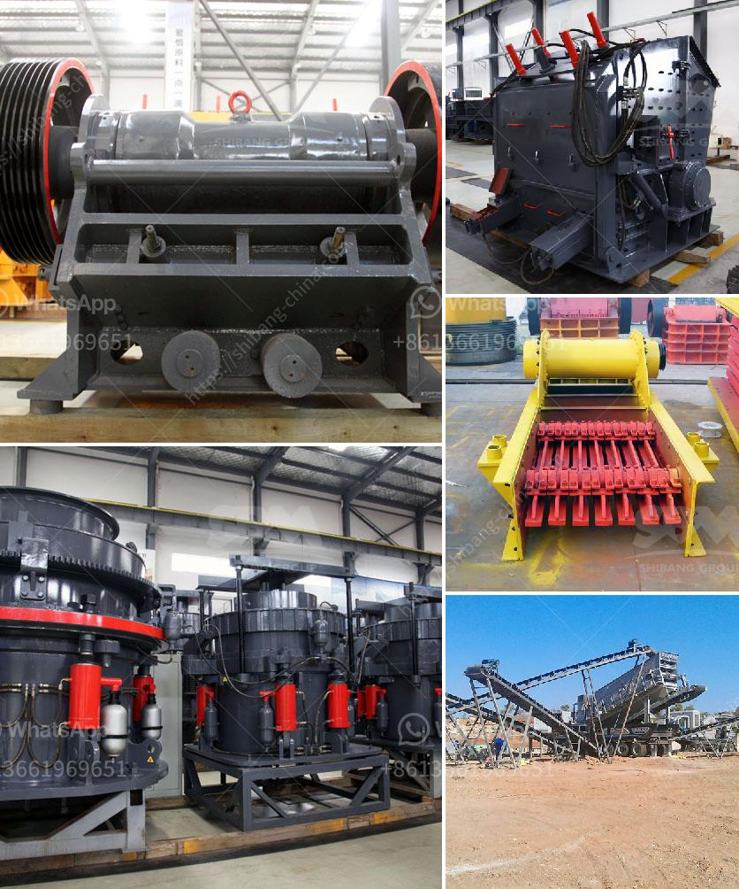

<h3>grinding equipments grinding equipments</h3>
Grinding equipment is an essential tool utilized in various industries such as metalworking, construction, manufacturing, and mining. This equipment is responsible for the precision removal of excess material from workpieces, resulting in a smooth and finished surface. With advancements in technology, grinding equipment has evolved to become more efficient, versatile, and capable of handling a wide range of materials.

The primary purpose of grinding equipment is to achieve precision and accuracy in the manufacturing process. It is commonly used in metalworking applications where precision and uniformity are crucial. The process involves the use of an abrasive wheel or belt that rotates rapidly to remove the desired amount of material from the workpiece. By carefully controlling factors such as speed, pressure, and direction, the grinder can achieve the desired result, whether it be a flat, smooth surface or a specific shape.

One of the main advantages of grinding equipment is its versatility. It can be used for a variety of applications and materials, such as metals, plastics, ceramics, and composites. For example, in the metalworking industry, grinding equipment is commonly used to sharpen cutting tools, remove burrs or sharp edges, and polish surfaces. In construction, it is employed for leveling and smoothing concrete surfaces before applying finishes. In mining, grinding equipment is used to break down large rocks and ore particles, making them easier to extract and process.

Grinding equipment comes in various forms, each designed for specific applications and requirements. The most common types include surface grinders, cylindrical grinders, and centerless grinders. Surface grinders are used for surface finishing and flat grinding, while cylindrical grinders are ideal for cylindrical or tapered shapes. Centerless grinders, on the other hand, are specifically designed for precision grinding of cylindrical workpieces without the need for centers or fixtures.

Advancements in grinding equipment technology have significantly improved its efficiency and effectiveness. Modern grinders have incorporated automation and computer numerical control (CNC) technology, allowing for precise control and repeatability. CNC grinders are capable of performing complex operations with minimal human intervention, resulting in improved accuracy, reduced cycle times, and increased productivity.

Furthermore, grinding equipment has become more environmentally friendly through the use of water-based coolants and filtration systems. These advancements have reduced the generation of harmful dust and debris, making grinding processes safer and cleaner.

As with any industrial machinery, proper maintenance and regular inspections are crucial for ensuring optimal performance and longevity. Grinding equipment should be regularly cleaned, calibrated, and lubricated to prevent wear and tear. Additionally, safety protocols should be strictly followed to minimize the risk of accidents and injuries.

In conclusion, grinding equipment plays a vital role in metalworking and various other industries. Its precision and versatility make it indispensable for achieving desired finishes, shapes, and dimensions. With continuous advancements in technology and increasing automation, grinding equipment is set to further enhance productivity and efficiency in industrial processes.
<h3>Contact us</h3><ul><li><strong>Whatsapp:&nbsp;<a href="https://wa.me/8613661969651">+8613661969651</a></strong></li><li><a href="https://swt.shibang-china.com/?git&amp;zhl&amp;grinding equipments grinding equipments"><strong>Online Service(chat now)</strong></a></li></ul><h3>Related</h3><ul><li><a href='crusher price in oman.md'>crusher price in oman</a></li><li><a href='gold mining equipment in south africa for sale.md'>gold mining equipment in south africa for sale</a></li><li><a href='rock crusher zenith.md'>rock crusher zenith</a></li><li><a href='kaolin crusher machine.md'>kaolin crusher machine</a></li><li><a href='limestone crushers for sale.md'>limestone crushers for sale</a></li></ul>