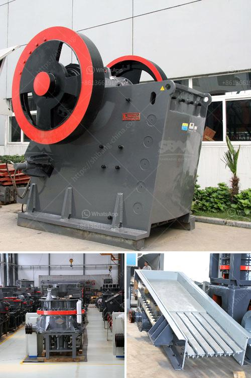

<h3>grinding in vertical roller mill</h3>
The cement industry is constantly looking for ways to make the manufacturing process more efficient. Over the last decades, the grinding process for cement production has undergone significant changes. It is now widely regarded as the most efficient method of cement production by way of achieving both high quality and high yield.

One of the key components of the grinding process is the vertical roller mill (VRM). This piece of equipment is essential for grinding clinker and other materials in cement production, such as gypsum, slag, and fly ash. It plays a crucial role in the cement manufacturing process by grinding materials into the required fineness for subsequent pyro-processing stages.

The VRM is known for its high grinding efficiency, low power consumption, and consistent product quality. Unlike traditional ball mills, the VRM operates with lower energy consumption and also eliminates the need for a separate drying process. This results in significant cost savings for cement producers.

The principle of grinding in a VRM involves a bed of material being crushed between two large grinding rollers. These rollers move in a relatively slow rotational motion but exert a tremendous grinding force on the material. The pressure generates micro-fracturing within the particles, reducing their size to the desired fineness. The crushed material is then carried upward by gas and discharged through a classifier, removing any oversized particles. The finer particles are sent to the separator and collected as a final product.

One of the most significant advantages of the VRM is its ability to grind a wide range of materials, including very hard ones like clinker, and brittle materials such as slag. This versatility allows cement manufacturers to use a variety of raw materials in their production process, thereby reducing dependency on specific types of raw materials and increasing flexibility in sourcing.

Moreover, the VRM can be adjusted to produce different product qualities, allowing cement manufacturers to meet specific customer requirements. By controlling the process parameters, such as airflow, grinding pressure, and separator speed, cement manufacturers can optimize both the product quality and the production capacity of the VRM.

In recent years, there have been several advancements in VRM technology, further improving its grinding efficiency and operational reliability. This includes the development of more efficient grinding systems, better roller designs, and advanced control systems. These advancements have made the VRM even more attractive for cement producers looking to increase productivity and reduce energy consumption.

Overall, grinding in a vertical roller mill has become the preferred method for cement production due to its many advantages. Its high grinding efficiency, low power consumption, and ability to grind a wide range of materials make it a cost-effective solution for cement producers. As the cement industry continues to focus on sustainable and efficient manufacturing processes, the VRM will continue to play a crucial role in meeting these objectives.
<h3>Contact us</h3><ul><li><strong>Whatsapp:&nbsp;<a href="https://wa.me/8613661969651">+8613661969651</a></strong></li><li><a href="https://swt.shibang-china.com/?git&amp;zhl&amp;grinding in vertical roller mill"><strong>Online Service(chat now)</strong></a></li></ul><h3>Related</h3><ul><li><a href='kaolin processing equipment manufacturers in germany.md'>kaolin processing equipment manufacturers in germany</a></li><li><a href='gold washing machine.md'>gold washing machine</a></li><li><a href='indonesia vertical grinding machine.md'>indonesia vertical grinding machine</a></li><li><a href='small impact gold mill australia.md'>small impact gold mill australia</a></li><li><a href='smill grinding mill machine price.md'>smill grinding mill machine price</a></li></ul>