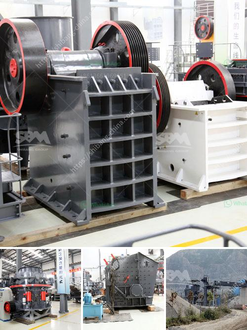

<h3>grinding machine its operation principle</h3>
A grinding machine, often shortened to grinder, is one of the power tools or machine tools used for grinding. It is a type of machining using an abrasive wheel as the cutting tool. Each grain of abrasive on the wheel's surface cuts a small chip from the workpiece via shear deformation.

Grinding is used to finish workpieces that must show high surface quality (e.g., low surface roughness) and high accuracy of shape and dimension. As the accuracy in dimensions in grinding is of the order of 0.000025 mm, in most applications, it tends to be a finishing operation and removes comparatively little metal.

Grinding machines not only grinds plastic and metals but also various other materials. In the B.C., grinding stones were used to sharpen and shape metal implements. Parts of the grinding machine are the base, grinding wheel, abrasive wheel, and workpiece. The base supports the machine and the workpiece being operated on. It can mount different types of grinding wheels and other attachments. The grinding wheel rotates at high speed for a precise finish.

The grinding process involves the cutting, shaving, and streaming of tiny chips of metal off the workpiece. The grinding machine isalso used by non-professionals for various different purposes. Armed with these machines, they can carry out all types of grinding. It is due to this reason that grinders are used widely in most mechanical industries. The grinding machine uses a three-point contact grinding wheel system, suiting the grinding of hollow grinding, flat grinding, straightening, and so on.

In summary, the grinding machine is a great tool that helps to shape and sharpen metals and other materials. It provides precision and efficiency in the manufacturing industry as well as for individuals looking to create intricate parts or reshape materials. With its ability to remove even the smallest amount of material accurately, it plays a critical role in various industries worldwide.
<h3>Contact us</h3><ul><li><strong>Whatsapp:&nbsp;<a href="https://wa.me/8613661969651">+8613661969651</a></strong></li><li><a href="https://swt.shibang-china.com/?git&amp;zhl&amp;grinding machine its operation principle"><strong>Online Service(chat now)</strong></a></li></ul><h3>Related</h3><ul><li><a href='stone crusher machine malaysia.md'>stone crusher machine malaysia</a></li><li><a href='impact crusher machine price.md'>impact crusher machine price</a></li><li><a href='price for jaw crusher.md'>price for jaw crusher</a></li><li><a href='portable concrete crusher for rent qatar.md'>portable concrete crusher for rent qatar</a></li><li><a href='cone crushers washing system.md'>cone crushers washing system</a></li></ul>