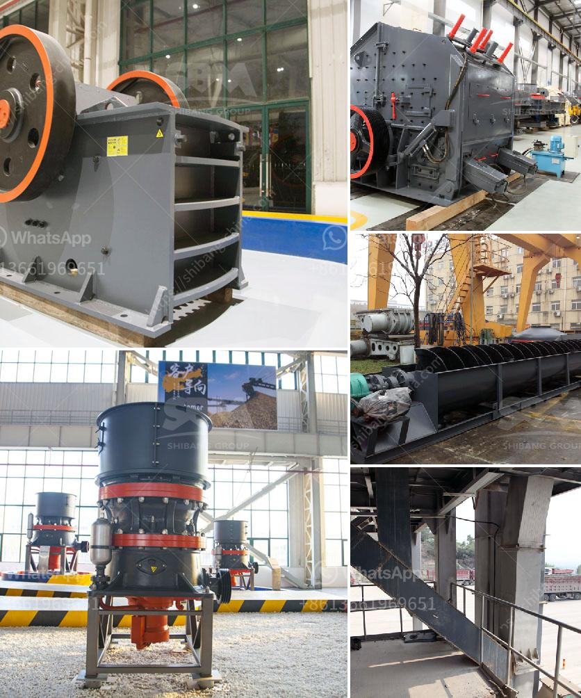

<h3>grinding machine types use in cement industry</h3>
Grinding machines are indispensable equipment in cement plants. In the process of cement production, the cement plant needs to complete the grinding of pulverized coal, raw meal powder, and cement products. The purpose of grinding is to increase the specific surface area of the material and reduce the particle size of the powder, thereby achieving the desired physical and chemical properties of the material. Grinding machines play an important role in achieving this goal.

1. Ball Mill: Ball mills are cylindrical grinding machines that are used to grind materials such as minerals, ores, and other materials contained in cement, clinker, and concrete. These materials usually contain a certain amount of moisture, so they need to be grinded into products with a certain fineness under the action of external forces to increase the workability of the materials.

2. Vertical Mill: Vertical mills are the most widely used and efficient grinding machines for raw meal grinding in cement plants. They are compact, energy-saving, and maintain high grinding efficiency. The vertical mill combines crushing, drying, grinding, and classifying functions into a single unit, which simplifies the process and improves production efficiency.

3. Roller Press: Roller press machines are used for pre-grinding or finish grinding in cement plants. The roller press essentially consists of two grinding rollers and a cage-like slab that supports the rollers when operating. The grinding rollers roll over the material bed, applying pressure and crushing the material.

4. High-Pressure Grinding Roll (HPGR): HPGR is a modern and energy-efficient grinding technology. It utilizes two counter-rotating rolls, one fixed and one floating, to subject the ore or raw material to compressive forces in a controlled manner. HPGR is increasingly being used in the cement industry due to its superior energy efficiency and ability to produce high-quality cement products.

Grinding machines are critical equipment in cement plants, ensuring efficient production and reducing energy consumption. Different types of grinding machines have unique performance characteristics, suitable for specific applications and requirements in cement production. Choosing the right grinding machine will help to optimize the cement production process and maximize cost savings.
<h3>Contact us</h3><ul><li><strong>Whatsapp:&nbsp;<a href="https://wa.me/8613661969651">+8613661969651</a></strong></li><li><a href="https://swt.shibang-china.com/?git&amp;zhl&amp;grinding machine types use in cement industry"><strong>Online Service(chat now)</strong></a></li></ul><h3>Related</h3><ul><li><a href='barite grinding companies.md'>barite grinding companies</a></li><li><a href='small rock crusher for sale.md'>small rock crusher for sale</a></li><li><a href='small concrete crusher rental nj.md'>small concrete crusher rental nj</a></li><li><a href='bentonite plant dimensions.md'>bentonite plant dimensions</a></li><li><a href='mobile stone crusher machine price and cost.md'>mobile stone crusher machine price and cost</a></li></ul>