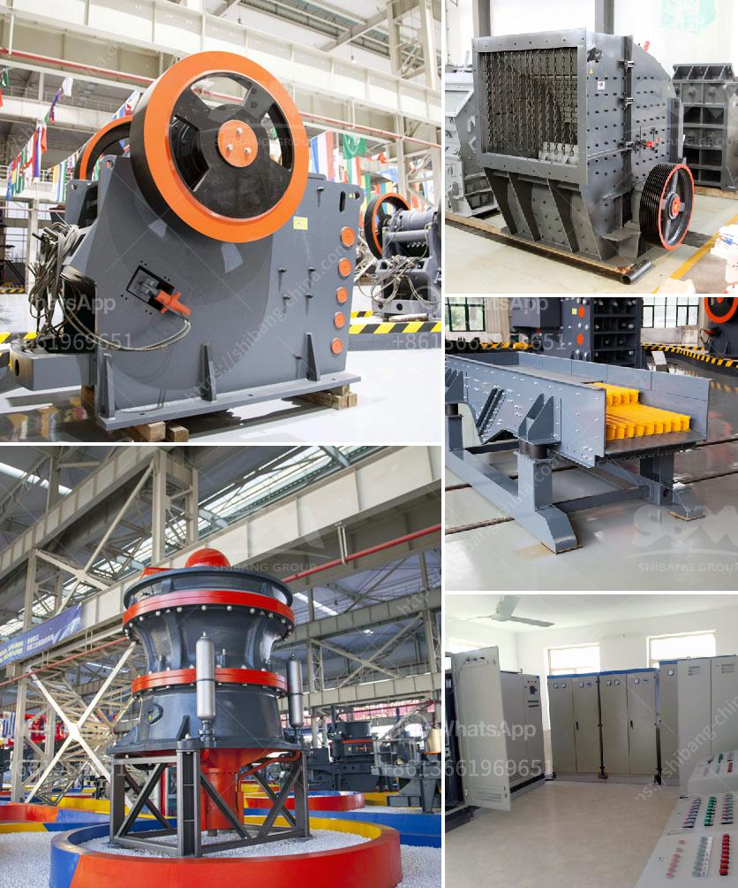

<h3>grinding machinery manufecture in ajmer</h3>
Ajmer, a city in the state of Rajasthan, India, has emerged as a significant hub for grinding machinery manufacture. With a strong and well-established manufacturing sector, Ajmer has become a hotbed for companies specializing in the production of grinding machines and equipment.

Grinding machinery plays a vital role in numerous industries, including automotive, construction, aerospace, and mining. It is used to remove material from a workpiece by using an abrasive wheel or belt. These machines are essential for achieving precision and high-quality finishes in various manufacturing processes.

One of the primary reasons for the rise of grinding machinery manufacture in Ajmer is the abundant availability of skilled labor. The city boasts a vast pool of engineers, technicians, and craftsmen, well-versed in the intricacies of machining and grinding processes. This skilled workforce enables the manufacturing companies in Ajmer to produce state-of-the-art grinding machinery that meets international standards.

Another factor contributing to the growth of the grinding machinery industry in Ajmer is the support and encouragement provided by the government. The state and central governments have implemented favorable policies and initiatives to promote manufacturing and industrial activities in the region. These measures include tax incentives, subsidies, and setting up dedicated industrial zones.

Furthermore, the presence of numerous engineering institutes and vocational training centers in Ajmer ensures a constant supply of well-trained professionals in the field of mechanical engineering. These institutions collaborate with the grinding machinery manufacturers, providing them with access to the latest research and technological advancements.

The grinding machinery produced in Ajmer is known for its superior quality, precision, and durability. The manufacturers in the region employ cutting-edge technology and adopt stringent quality control measures to ensure that their products meet the demanding expectations of their customers.

As a result, the grinding machinery manufactured in Ajmer has gained a reputation not only in the domestic market but also globally. Manufacturers from various countries are increasingly turning to Ajmer for sourcing grinding machinery, recognizing the reliability, efficiency, and cost-effectiveness of the products.

In conclusion, Ajmer's emergence as a leading center for grinding machinery manufacture has provided a significant boost to the manufacturing sector in the region. The availability of skilled labor, government support, and technological advancements have played a pivotal role in this growth. With their commitment to quality and precision, grinding machinery manufacturers in Ajmer are revolutionizing the way various industries approach their manufacturing processes.
<h3>Contact us</h3><ul><li><strong>Whatsapp:&nbsp;<a href="https://wa.me/8613661969651">+8613661969651</a></strong></li><li><a href="https://swt.shibang-china.com/?git&amp;zhl&amp;grinding machinery manufecture in ajmer"><strong>Online Service(chat now)</strong></a></li></ul><h3>Related</h3><ul><li><a href='mobile tracked crushers.md'>mobile tracked crushers</a></li><li><a href='industrial rock crusher.md'>industrial rock crusher</a></li><li><a href='concrete crushing plant business plan.md'>concrete crushing plant business plan</a></li><li><a href='stone crusher machinery china.md'>stone crusher machinery china</a></li><li><a href='5kg grinding ball mill.md'>5kg grinding ball mill</a></li></ul>