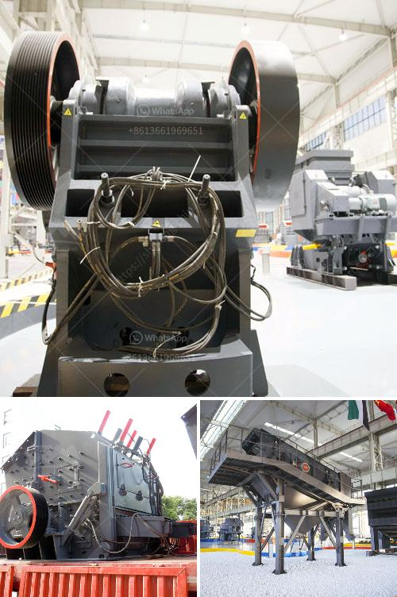

<h3>grinding machines for minerals in indonesia</h3>
Indonesia is known for its abundant natural resources, including minerals. The mining industry plays a significant role in contributing to the nation's economic growth. To extract valuable minerals, it is necessary to crush and grind raw ores into smaller pieces. Grinding machines are widely used in the mining industry for this purpose.

Grinding machines are designed to break down solid materials such as rocks, metals, and ores into smaller pieces. They are used to reduce the size of ore particles, enabling efficient mineral extraction processes. These machines are typically used in the crushing and grinding stages of mineral processing.

In Indonesia, the demand for minerals is constantly growing, necessitating the use of grinding machines to enhance efficiency and productivity in the mining industry. These machines are essential for processing raw ores and preparing them for further extraction processes.

There are various types of grinding machines used in the mining industry in Indonesia. The most commonly used ones include ball mills, rod mills, and autogenous mills. Each of these machines has its advantages and can be utilized depending on the specific requirements of the minerals being processed.

Ball mills are commonly used grinding machines that utilize rotating cylinders to grind the ore. They are versatile and can grind minerals of various sizes. The grinding medium in the ball mill is usually steel balls, which collide and grind the ore particles to the required size.

Rod mills, on the other hand, are similar to ball mills but use long rods instead of steel balls as the grinding medium. These rods are placed inside the mill and move continuously, effectively grinding the ore particles.

Autogenous mills are unique grinding machines that grind the ore without the need for additional grinding media. These mills use ore itself as the grinding medium, reducing the cost and energy consumption associated with grinding. Autogenous mills are commonly used for treating soft ores that do not require significant grinding.

The choice of grinding machine depends on various factors, including the hardness, size, and composition of the minerals being processed, as well as the desired product size and production capacity. It is important to select the appropriate type of grinding machine to ensure optimal performance and efficiency.

In recent years, technological advancements have improved the design and functionality of grinding machines. For instance, computer simulations and modeling techniques have enabled manufacturers to optimize the performance of grinding machines, leading to increased productivity and reduced energy consumption.

Furthermore, automated systems have been incorporated into grinding machines, allowing for remote monitoring and control of the grinding process. This not only enhances operational efficiency but also improves worker safety by minimizing direct exposure to the grinding environment.

In conclusion, grinding machines are indispensable in the mining industry in Indonesia for the efficient and productive extraction of minerals. The choice of grinding machine depends on the specific characteristics of the minerals being processed. Recent technological advancements have further enhanced the performance and efficiency of grinding machines. Investing in these machines can lead to significant improvements in the mining process, ultimately benefiting Indonesia's economy and its overall development.
<h3>Contact us</h3><ul><li><strong>Whatsapp:&nbsp;<a href="https://wa.me/8613661969651">+8613661969651</a></strong></li><li><a href="https://swt.shibang-china.com/?git&amp;zhl&amp;grinding machines for minerals in indonesia"><strong>Online Service(chat now)</strong></a></li></ul><h3>Related</h3><ul><li><a href='balls level in ball mill.md'>balls level in ball mill</a></li><li><a href='550 used cone crusher for sale.md'>550 used cone crusher for sale</a></li><li><a href='cost of a manganese processing plant in south africa.md'>cost of a manganese processing plant in south africa</a></li><li><a href='used crusher plants on sale in uae.md'>used crusher plants on sale in uae</a></li><li><a href='small portable rock crusher for sale africa.md'>small portable rock crusher for sale africa</a></li></ul>