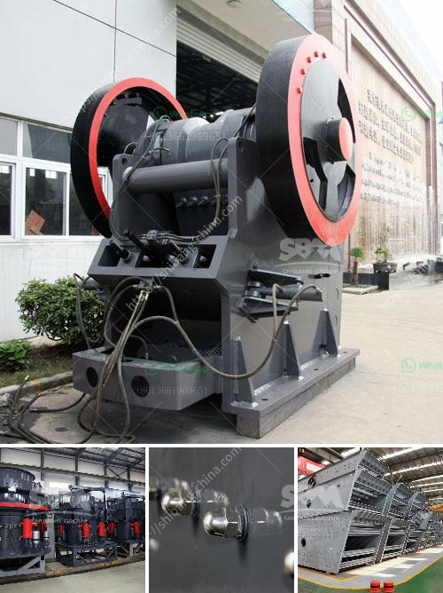

<h3>grinding media loading in ball mill machine</h3>
Grinding Media Loading in Ball Mill Machine: A Key Component to Achieving Consistent Grinding Results

There are many factors that contribute to the effectiveness of a ball mill grinding process. Efficiency, duress, longevity, capability, and crucially, the overall quality of the final product are all strongly influenced by the grinding media load.

The critical role of grinding media load in the ball mill cannot be underestimated. Ensuring proper loading, within the recommended range, is pivotal to achieving optimal mill performance. Incorrect or excessive loading can cause the mill to become inefficient, resulting in poor grinding, subpar product quality, excessive energy consumption, and increased equipment wear. On the other hand, an insufficient load can also compromise grinding efficiency, causing mill inefficiency and preventing the desired fineness from being achieved.

The loading of grinding media in a ball mill machine plays an important role in enabling the balls to effectively grind the material being processed. Understanding how media loading impacts grinding efficiency and ultimately, the final product’s quality, is crucial. This article will outline the key considerations involved in loading grinding media into a ball mill machine.

The first step is to understand the specifications required for the grinding media. Factors such as the size, density, and hardness of the grinding balls play a crucial role in effective grinding. Different types of materials require different grinding media specifications, and these specifications should be adhered to strictly to ensure optimal mill performance.

Once the appropriate grinding media is selected, the loading process must be carried out meticulously. Overloading the mill with grinding media can result in excessive wear and damage to both the mill and the grinding media. It can also affect the overall grinding efficiency. Underloading, on the other hand, can lead to ineffective grinding, resulting in a subpar final product. Therefore, it is vital to strike a balance between the amount of grinding media loaded and the mill capacity, taking into account the desired grinding efficiency and the properties of the material being processed.

Another important aspect of grinding media loading is the distribution of the media within the mill. Uneven distribution can lead to ineffective grinding and reduced overall efficiency. Achieving a uniform and optimal distribution can be challenging but can greatly enhance the grinding process.

Periodic monitoring of the grinding media loading helps maintain the desired grinding efficiency and product quality. By regularly checking the media load, adjustments can be made to optimize the mill's performance. Factors such as changes in the material being processed, wear of the grinding media, and changes in mill conditions may necessitate readjusting the media load to ensure optimal performance.

In conclusion, proper loading of grinding media in a ball mill machine is crucial for achieving consistent grinding results and obtaining a high-quality final product. Failure to load the media correctly can lead to poor grinding efficiency, excessive wear, and suboptimal product quality. Understanding the specifications for the grinding media, achieving a uniform distribution, and monitoring and adjusting the media load as necessary are all essential steps in ensuring optimal grinding performance. By paying close attention to the grinding media loading, mill operators can maximize the efficiency and effectiveness of their ball mill machines and ultimately deliver top-notch grinding results.
<h3>Contact us</h3><ul><li><strong>Whatsapp:&nbsp;<a href="https://wa.me/8613661969651">+8613661969651</a></strong></li><li><a href="https://swt.shibang-china.com/?git&amp;zhl&amp;grinding media loading in ball mill machine"><strong>Online Service(chat now)</strong></a></li></ul><h3>Related</h3><ul><li><a href='business plan and cost for crushing project.md'>business plan and cost for crushing project</a></li><li><a href='to 200 tph pe 750 1060 copper ore jaw crusher.md'>to 200 tph pe 750 1060 copper ore jaw crusher</a></li><li><a href='all model vsi crusher.md'>all model vsi crusher</a></li><li><a href='hydro sizing silica sand crusher plant.md'>hydro sizing silica sand crusher plant</a></li><li><a href='mobile cone crushing station for sale.md'>mobile cone crushing station for sale</a></li></ul>