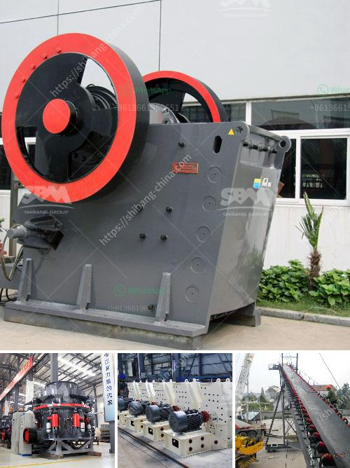

<h3>grinding mill for corundum</h3>
A grinding mill for corundum is a specialized piece of equipment used to grind substances into a fine powder. These mills are typically used for applications in the food, chemical, and pharmaceutical industries.

Corundum, also known as aluminum oxide, is a naturally occurring mineral that is extremely hard and abrasive. It is commonly used as an abrasive material in various industrial processes. The corundum grinding mill is designed to produce a high-quality powder with a uniform particle size distribution.

One key feature of a corundum mill is its grinding chamber. The grinding chamber is lined with corundum stones, which are extremely hard and provide excellent resistance to wear. This ensures that the mill can withstand the harsh grinding conditions and maintain its performance over time.

The corundum mill also features a powerful motor that allows for high-speed grinding. This enables the mill to process large quantities of material in a short amount of time, making it ideal for industrial-scale production.

In addition to its high-speed grinding capabilities, the corundum mill also offers precise control over the particle size of the final product. This is achieved through an adjustable grinding gap, which allows the user to modify the distance between the corundum stones. By adjusting the grinding gap, the user can produce particles of different sizes to meet specific requirements.

Overall, a grinding mill for corundum is a reliable and efficient tool for grinding substances into a fine powder. Its robust construction, high-speed grinding capabilities, and precise particle size control make it an essential piece of equipment in various industries. Whether for food processing, chemical production, or pharmaceutical applications, a corundum mill can deliver consistent and high-quality results.
<h3>Contact us</h3><ul><li><strong>Whatsapp:&nbsp;<a href="https://wa.me/8613661969651">+8613661969651</a></strong></li><li><a href="https://swt.shibang-china.com/?git&amp;zhl&amp;grinding mill for corundum"><strong>Online Service(chat now)</strong></a></li></ul><h3>Related</h3><ul><li><a href='process chart of sand washing plant.md'>process chart of sand washing plant</a></li><li><a href='modeling of power mill ball.md'>modeling of power mill ball</a></li><li><a href='impact crusher machine price.md'>impact crusher machine price</a></li><li><a href='chalk manufacturing machinechalk mining machinery.md'>chalk manufacturing machinechalk mining machinery</a></li><li><a href='small scale mining plant philippines diagram.md'>small scale mining plant philippines diagram</a></li></ul>