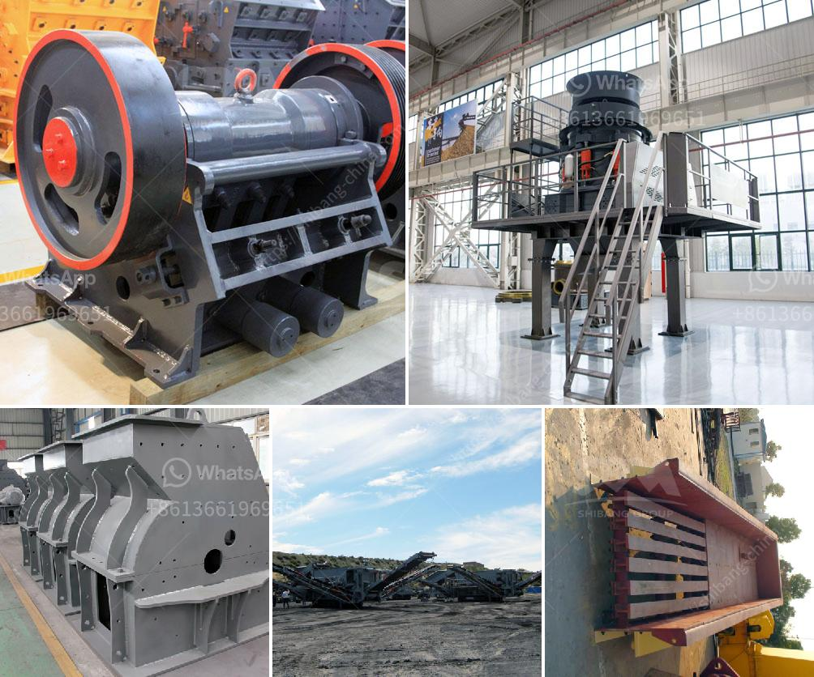

<h3>grinding mill for limestone</h3>
Limestone is a sedimentary rock formed primarily from calcium carbonate deposits. Limestone is widely used as a building material, as a raw material in the production of cement, and in agriculture to neutralize soil acidity. However, the majority of limestone deposits are not suitable for industrial use. Hence, it is crucial to grind limestone into a suitable size using a reliable grinding mill for limestone.

Grinding mills are widely used in various industries like mining, cement, ceramics, construction, and more. One of the essential equipment in these industries is grinding mills. Grinding mills help in the process of reducing large-sized rocks into smaller sizes, allowing them to be further processed. Among the many grinding mills available, the most widely used one is the Raymond mill.

Raymond mill is a commonly used grinding mill for limestone. Its structure is mainly composed of a host machine, analysis machine, blower, finished product cyclone separator, pipeline device, and motor. Its main components, such as the grinding roller and grinding ring, adopt high-quality materials, greatly improving the grinding efficiency and capacity of the mill.

1. High efficiency and energy-saving: Compared with ordinary mills, the grinding efficiency of Raymond mills is increased by more than 40%, which saves a considerable amount of energy.

2. Wide application range: The final powder size can be adjusted within a range of 50-450 mesh, making it suitable for various applications in different industries.

3. Stable operation and low maintenance cost: The grinding mill is equipped with a unique sealing device, which effectively avoids dust spillover and extends the service life of the equipment. Additionally, the centralized control system ensures stable performance, reducing the need for frequent maintenance.

4. Environmental friendliness: The grinding mill for limestone adopts advanced dust removal technology, which effectively reduces the environmental pollution caused by dust during the grinding process.

Limestone grinding mills can be broadly classified into several categories: Raymond mill, hammer mill, ball mill, vertical mill, and ultrafine mill. Raymond mill, as a common grinding mill for limestone, has a long history and is constantly optimized and upgraded by current technology. It is widely used for non-metallic minerals with Mohs hardnesses below 7 and humidity below 6%, such as limestone, marble, gypsum, barite, talc, wollastonite, feldspar, etc.

Even though Raymond mill is efficient and widely used, it is worth considering other types of grinding mills based on specific applications. For instance, if the particle size requirements are relatively high, and the capacity requirement is not very large, a ball mill may be a suitable alternative.

In conclusion, a grinding mill for limestone plays a vital role in limestone processing. With the advancement and continuous improvement of technology, the grinding mill has made remarkable progress in terms of performance, ease of operation, and energy saving. Grinding mills, such as Raymond mills, are widely used and valued in multiple industries. With their ability to process limestone into fine powders, they contribute significantly to various industrial applications.
<h3>Contact us</h3><ul><li><strong>Whatsapp:&nbsp;<a href="https://wa.me/8613661969651">+8613661969651</a></strong></li><li><a href="https://swt.shibang-china.com/?git&amp;zhl&amp;grinding mill for limestone"><strong>Online Service(chat now)</strong></a></li></ul><h3>Related</h3><ul><li><a href='sand stone crusher.md'>sand stone crusher</a></li><li><a href='best grinding mills of chslk limestone.md'>best grinding mills of chslk limestone</a></li><li><a href='used crusher for sale sell buy.md'>used crusher for sale sell buy</a></li><li><a href='ball mill for sale.md'>ball mill for sale</a></li><li><a href='german crusher for sale.md'>german crusher for sale</a></li></ul>