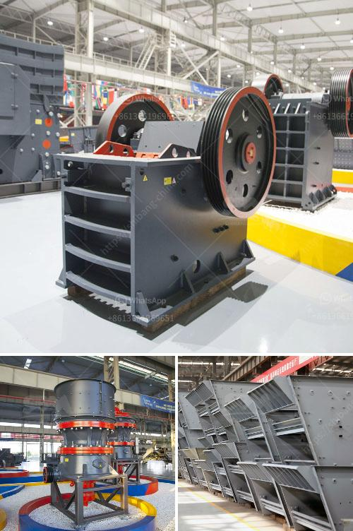

<h3>grinding mill plant cost</h3>
Grinding mills are essential equipment in various industries like mining, cement, and construction. However, the cost of setting up a grinding mill plant can be quite significant, making it crucial for plant owners to consider different factors before making any investment decisions. This article will discuss the key factors that can impact grinding mill plant costs.

The size and capacity of a grinding mill plant are important considerations since they determine the overall cost. Larger plants require more space, investment in infrastructure, and electrical systems. Additionally, high-capacity mills typically have more sophisticated features and equipment, resulting in higher costs. It is important for plant owners to evaluate their production needs and consider the optimal size and capacity of the grinding mill plant to minimize costs.

The quality and durability of the grinding mill plant play a significant role in the overall cost. Investing in a high-quality plant may seem expensive initially, but it can save money in the long run by reducing maintenance, repair, and replacement costs. Reliable and durable components, such as grinding media, liners, and drive systems, can significantly impact the plant's performance and lifespan. Plant owners should consider the reputation of the manufacturers and choose equipment that offers the best value for money.

Energy consumption is a major expense in operating a grinding mill plant. Energy-efficient mills can result in significant cost savings over time. Factors such as motor efficiency, grinding media selection, and power consumption should be carefully analyzed. Choosing mills with advanced technologies, such as vertical roller mills or high-pressure grinding rolls, can provide substantial energy savings. Investing in energy-efficient equipment may have a higher upfront cost, but it can lead to considerable long-term savings.

Regular maintenance and the availability of spare parts are important factors that can impact the cost of operating a grinding mill plant. Plant owners should ensure that they have access to skilled maintenance personnel and a reliable supplier for spare parts. Routine maintenance can prevent breakdowns, improve efficiency, and extend the lifespan of the equipment. It is advisable to invest in mills that are easy to maintain and have readily available spare parts to minimize downtime and reduce costs.

Transportation and installation costs can also add to the overall grinding mill plant cost. Mills are often heavy and bulky, requiring specialized transportation equipment. Additionally, the installation process involves skilled labor and may require additional construction work. Plant owners should consider these expenses when budgeting for a grinding mill plant.

In conclusion, setting up a grinding mill plant involves several cost considerations. Plant owners should carefully evaluate factors such as size, capacity, quality, energy efficiency, maintenance, and transportation before making any investment decisions. By considering these factors, plant owners can optimize their investment and ensure long-term success in their grinding mill operations.
<h3>Contact us</h3><ul><li><strong>Whatsapp:&nbsp;<a href="https://wa.me/8613661969651">+8613661969651</a></strong></li><li><a href="https://swt.shibang-china.com/?git&amp;zhl&amp;grinding mill plant cost"><strong>Online Service(chat now)</strong></a></li></ul><h3>Related</h3><ul><li><a href='stone crusher with tractor.md'>stone crusher with tractor</a></li><li><a href='bentonite plant system.md'>bentonite plant system</a></li><li><a href='portable concrete crusher for rent qatar.md'>portable concrete crusher for rent qatar</a></li><li><a href='ball mill grinders cost.md'>ball mill grinders cost</a></li><li><a href='china make vertical roller mill.md'>china make vertical roller mill</a></li></ul>