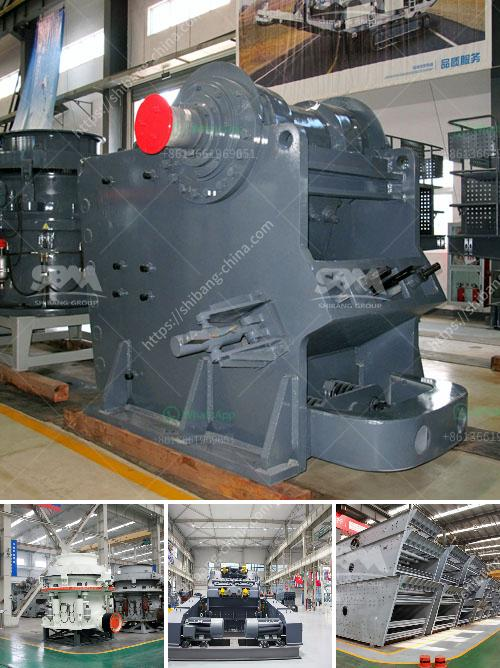

<h3>grinding mill price in</h3>
A grinding mill is a common tool that is utilized to break down various materials into smaller pieces. These machines are utilized in various industries, including mining, construction, pharmaceuticals, and even food processing. With the demand for grinding mills increasing, it is essential to understand the factors that influence their prices.

One key factor that determines the price of a grinding mill is the size of the machine. Grinding mills come in various sizes to cater to different needs. However, larger mills tend to have higher prices due to their higher production capacity and more advanced features. Smaller mills, on the other hand, are more affordable and suitable for those with lower production requirements.

Another factor that influences grinding mill prices is the quality and durability of the materials used in its construction. Grinding mills that are made from high-quality materials, such as steel or cast iron, tend to be more expensive. This is because these materials offer better resistance to wear and tear, ensuring that the mill has a longer lifespan. On the other hand, mills made from cheaper materials may have a lower upfront cost but may require frequent repairs or replacement in the long run.

The technology and features incorporated into a grinding mill also contribute to its price. Grinding mills that have more advanced features, such as adjustable speeds, automated controls, or specialized grinding mechanisms, tend to have higher price tags. These features enhance the mill's efficiency, making it easier to achieve the desired fineness or consistency of the ground material. However, mills with basic or manual functions are more affordable options for those with simpler grinding needs.

Furthermore, the brand and reputation of the manufacturer also play a role in determining grinding mill prices. Well-established brands that have a track record of producing reliable and high-performing mills tend to command higher prices. This is because customers are willing to pay a premium for the assurance of quality, after-sales support, and longevity. On the other hand, lesser-known brands or manufacturers may offer lower-priced grinding mills as a way to penetrate the market or attract customers away from more established competitors.

Geographical factors also impact grinding mill prices. The cost of raw materials, labor, and production varies from one region to another, causing variations in pricing. Mills manufactured in regions with higher production costs, such as Western countries, tend to be more expensive than those produced in regions with lower overheads, such as certain Asian countries. Additionally, factors like import taxes, shipping costs, and currency exchange rates can further influence the final price of a grinding mill.

In conclusion, several factors contribute to the pricing of grinding mills. These include the size of the machine, the quality of materials used, the incorporated technology and features, the brand and reputation of the manufacturer, and geographical factors. Understanding these factors can help potential buyers make informed decisions when purchasing grinding mills, ensuring that they get the best value for their money.
<h3>Contact us</h3><ul><li><strong>Whatsapp:&nbsp;<a href="https://wa.me/8613661969651">+8613661969651</a></strong></li><li><a href="https://swt.shibang-china.com/?git&amp;zhl&amp;grinding mill price in"><strong>Online Service(chat now)</strong></a></li></ul><h3>Related</h3><ul><li><a href='jaw crusher plant for sale.md'>jaw crusher plant for sale</a></li><li><a href='jual crusher batubara di indonesia.md'>jual crusher batubara di indonesia</a></li><li><a href='ball mill manufacturers in malaysia.md'>ball mill manufacturers in malaysia</a></li><li><a href='indonesia vertical grinding machine.md'>indonesia vertical grinding machine</a></li><li><a href='hydraulic cone crusher application.md'>hydraulic cone crusher application</a></li></ul>