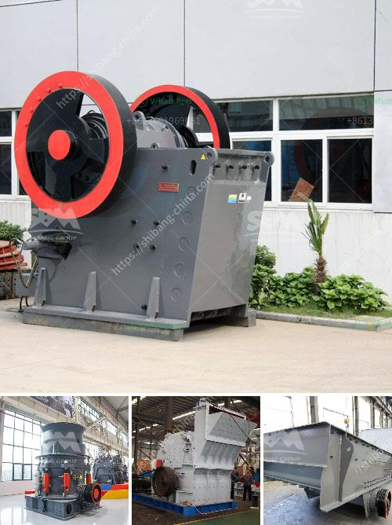

<h3>grinding mills for sale in pakistan</h3>
Grinding mills are used in various industries to process raw materials, including cement, coal, gypsum, limestone, clay, and minerals. These mills grind material into powder form and help in reducing its particle size for further processing and utilization. In Pakistan, there is a growing demand for grinding mills, both locally and internationally, due to the country's expanding industrial sector. This article will explore the availability and benefits of grinding mills for sale in Pakistan.

Grinding mills are crucial equipment for many industrial sectors in Pakistan. With the rapid development of mining industry and cement industry, the demand for grinding mills increases sharply. There are more than one hundred companies engaged in its manufacturing in the country. These mills are either locally owned or imported from other countries. However, due to the high cost of importing such machinery, many local industries prefer to purchase grinding mills from Pakistan-based manufacturers.

One of the popular grinding mill manufacturers in Pakistan is Acmad Grinding System. This company offers a wide range of grinding mills for various applications. Their mills are designed with advanced technology and are capable of grinding materials to different fineness levels. Acmad Grinding System's mills are known for their reliability, efficient performance, and robust construction. They offer both dry and wet grinding mills suitable for different industries.

Another renowned manufacturer is Shaheen Grinding Mills. This company offers a diverse range of grinding mills for various applications, including mining, cement, and chemicals. Their mills are designed to provide high efficiency and reliability in grinding operations. Shaheen Grinding Mills' mills are made with high-quality materials and advanced technologies to ensure long-lasting performance. They also provide customization options to meet the specific requirements of their customers.

The availability of grinding mills for sale in Pakistan is beneficial for both large-scale industries and small businesses. These mills can help in reducing the operational costs associated with grinding operations. By investing in a high-quality grinding mill, businesses can significantly improve their production efficiency, thereby increasing their overall profitability.

In addition to their cost-saving benefits, grinding mills also contribute to environmental sustainability. These mills are designed to minimize particle pollution, providing a cleaner working environment. Furthermore, grinding mills facilitate the utilization of raw materials, reducing waste and promoting recycling. This is particularly crucial as sustainability practices are becoming increasingly important in today's world.

To conclude, grinding mills play a crucial role in various industries in Pakistan. With a growing industrial sector, the demand for grinding mills is expected to rise even further. Fortunately, there are numerous domestic manufacturers offering high-quality grinding mills for sale in the country. These mills provide cost-saving benefits, increase production efficiency, and contribute to environmental sustainability. By investing in a grinding mill, businesses in Pakistan can enhance their operations and remain competitive in the market.
<h3>Contact us</h3><ul><li><strong>Whatsapp:&nbsp;<a href="https://wa.me/8613661969651">+8613661969651</a></strong></li><li><a href="https://swt.shibang-china.com/?git&amp;zhl&amp;grinding mills for sale in pakistan"><strong>Online Service(chat now)</strong></a></li></ul><h3>Related</h3><ul><li><a href='cara menentukan kapasitas belt conveyor.md'>cara menentukan kapasitas belt conveyor</a></li><li><a href='crusher primary cone crusher.md'>crusher primary cone crusher</a></li><li><a href='cost of stone crusher in kenya.md'>cost of stone crusher in kenya</a></li><li><a href='stone quarrying companies in tanzania.md'>stone quarrying companies in tanzania</a></li><li><a href='rotary kiln producers in indonesia.md'>rotary kiln producers in indonesia</a></li></ul>