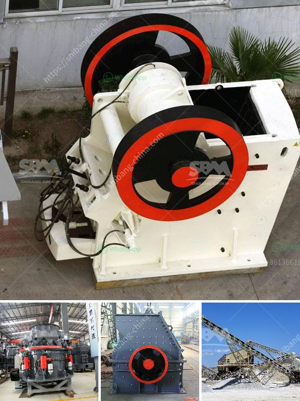

<h3>grinding of limestone for cement production</h3>
Grinding of limestone for cement production is an important process in the cement manufacturing process. This process involves grinding the limestone to a fine powder, which is then used as the main ingredient in cement.

Limestone is a sedimentary rock composed primarily of calcium carbonate, along with other minerals such as clay, silica, and iron oxide. It is abundant in nature and found in various parts of the world. Limestone is a key raw material used in cement production due to its high calcium content. When limestone is crushed and ground into a fine powder, it becomes the primary ingredient in cement.

The process of grinding limestone for cement production involves various stages. First, the limestone is quarried from the mines and undergoes primary crushing and screening. Then, it is transported to the grinding mill, where it is mixed with other raw materials such as clay or shale. The mixture is then heated to a high temperature in a kiln, a large cylindrical furnace, to produce clinker. The clinker is then finely ground with gypsum to produce cement.

The grinding of limestone is a vital step in the cement manufacturing process as it ultimately determines the quality and strength of the final product. The finer the grind, the better the cement. Grinding of limestone requires high energy and specialized machinery to ensure a consistent and efficient process.

In conclusion, the grinding of limestone for cement production is a crucial process that requires high efficiency and specialized machinery. It is an energy-intensive operation that plays a significant role in producing high-quality cement. The process involves crushing and grinding limestone to a fine powder, which is then used as a primary ingredient in cement. Overall, grinding limestone for cement production is a critical step in the cement manufacturing process.
<h3>Contact us</h3><ul><li><strong>Whatsapp:&nbsp;<a href="https://wa.me/8613661969651">+8613661969651</a></strong></li><li><a href="https://swt.shibang-china.com/?git&amp;zhl&amp;grinding of limestone for cement production"><strong>Online Service(chat now)</strong></a></li></ul><h3>Related</h3><ul><li><a href='sand conveyor for sale.md'>sand conveyor for sale</a></li><li><a href='crushing machine from china.md'>crushing machine from china</a></li><li><a href='project report for stone crushing plant.md'>project report for stone crushing plant</a></li><li><a href='for sale prices jaw crushe.md'>for sale prices jaw crushe</a></li><li><a href='logo of stone crusher.md'>logo of stone crusher</a></li></ul>