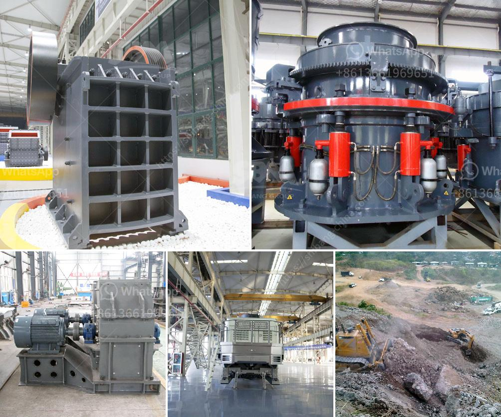

<h3>grinding pigments for technology</h3>
Innovation in technology relies heavily on the use of pigments in various applications, from displays and coatings to solar cells and sensors. These pigments provide not only vibrant colors but also play a crucial role in enhancing the functionality and performance of technological devices. To produce high-quality pigments for these cutting-edge technologies, grinding techniques have become indispensable.

Grinding pigments involves the process of reducing solid materials into fine particles, which can then be dispersed and incorporated into different mediums. The key objective is to obtain particles of uniform size and shape to achieve the desired optical properties and maximize the efficiency of the pigments. This process significantly impacts the overall quality and performance of the final product.

One area where grinding pigments have revolutionized technology is in the development of displays. With the advent of high-definition screens and advanced technologies like LED and OLED, the demand for pigments with superior color purity and stability has skyrocketed. Grinding techniques allow manufacturers to precisely control the particle size and distribution, resulting in brighter, sharper, and more accurate displays.

Coatings, another crucial application, also benefit from grinding pigments. Coatings not only provide a protective layer but also enhance the appearance and visual appeal of various products, ranging from automotive to electronics. Grinding techniques enable manufacturers to achieve a wide range of colors, textures, and effects, giving products a unique and captivating finish.

Researchers and scientists are also exploring the use of pigments in renewable energy technologies. In this context, grinding pigments are employed to improve the light absorption capability of materials, such as in the production of solar cells. By reducing pigments to the nanoscale, researchers can optimize their optical properties, leading to enhanced energy conversion efficiencies.

Moreover, grinding pigments has found applications in the field of sensors and detectors. Nanoparticles derived from grinding techniques can be incorporated into sensors to enhance their sensitivity and selectivity. These finely ground pigments not only improve the response time but also contribute to the accuracy and reliability of the measurements, making them invaluable in various monitoring and detection systems.

However, grinding pigments for technology comes with its challenges. Achieving the desired particle size and distribution requires expertise and precise control over the grinding parameters. Factors such as milling time, speed, and the choice of grinding media must be carefully considered to avoid undesirable effects, such as agglomeration, color shifts, or reduced performance.

Moreover, the choice of pigments used in technology is crucial. Certain pigments may exhibit poor stability or resistance to environmental conditions, impacting the durability and reliability of the final product. This necessitates rigorous testing and quality control to ensure the pigments meet the stringent demands of the technological applications.

In conclusion, grinding pigments play a vital role in advancing technology by providing vibrant colors and enhancing functional properties. From displays to solar cells, these finely ground particles unlock innovation by improving the efficiency, performance, and aesthetic appeal of technological devices. While challenges exist, advancements in grinding techniques and pigment technology continue to pave the way for groundbreaking innovations in the technological landscape.
<h3>Contact us</h3><ul><li><strong>Whatsapp:&nbsp;<a href="https://wa.me/8613661969651">+8613661969651</a></strong></li><li><a href="https://swt.shibang-china.com/?git&amp;zhl&amp;grinding pigments for technology"><strong>Online Service(chat now)</strong></a></li></ul><h3>Related</h3><ul><li><a href='china stone crusher.md'>china stone crusher</a></li><li><a href='roller mill grinding roller.md'>roller mill grinding roller</a></li><li><a href='grinding and milling machines.md'>grinding and milling machines</a></li><li><a href='total cost of stone crushing unit in india.md'>total cost of stone crushing unit in india</a></li><li><a href='price hammer mill price mill pulverizer.md'>price hammer mill price mill pulverizer</a></li></ul>