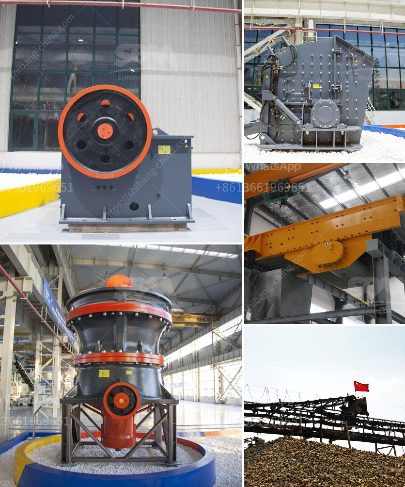

<h3>grinding raymond dolomite</h3>
Construction industry professionals constantly seek innovative solutions to optimize their operations and increase efficiency. One such solution is the use of grinding equipment like Raymond dolomite mills. This versatile machinery has become increasingly popular in construction projects, enabling contractors to grind and process dolomite, a versatile mineral used in various applications.

Raymond dolomite grinding mills are specifically designed to grind and process dolomite, a mineral composed of calcium magnesium carbonate. Dolomite is widely used in the construction industry due to its beneficial properties. It enhances cement strength, reduces shrinkage, and improves the overall workability of concrete mixtures.

In construction projects, grinding Raymond dolomite offers numerous advantages. Firstly, these mills significantly reduce dolomite particles to a fine powder, enhancing its reactivity. Finely-ground dolomite accelerates the hydration of cement, leading to faster setting time. This advantage is especially critical in time-sensitive projects, where concrete needs to gain strength rapidly.

Secondly, grinding dolomite using Raymond mills promotes uniformity in particle size distribution. Uniformity is a crucial factor in construction projects as it ensures consistent performance of concrete mixtures. This attribute enhances the quality and durability of construction elements such as buildings, bridges, and pavements.

Grinding Raymond dolomite also enhances the flowability and workability of concrete. Dolomite particles that are finely ground act as a lubricant, reducing the friction between cement grains and enabling a smoother mixture. The improved flowability facilitates the pouring and placement of concrete, contributing to the overall efficiency of the construction process.

Furthermore, Raymond dolomite grinding mills are known for their energy efficiency, making them a sustainable choice for construction projects. These mills employ advanced technology, allowing for the precise control of grinding parameters such as pressure, temperature, and rotation speed. This control minimizes energy consumption and maximizes the utilization of dolomite resources.

Moreover, grinding Raymond dolomite adds value to construction waste management. In many projects, dolomite is extracted alongside other minerals during site excavations. Instead of discarding this waste, it can be processed and utilized within the project, reducing the need for additional raw materials. This approach contributes to sustainable construction practices and reduces environmental impact.

For contractors, the efficient grinding of Raymond dolomite offers economic benefits. By enhancing the reactivity and workability of dolomite, the consumption of cement and other binders can be minimized. This reduction in raw material usage translates into cost savings for construction companies. Additionally, the enhanced durability of concrete mixtures containing finely-ground dolomite decreases maintenance and repair expenses in the long term.

In conclusion, grinding Raymond dolomite has proven to be a highly advantageous solution for the construction industry. Its ability to enhance cement strength, improve workability, and increase efficiency makes it an invaluable tool for contractors. By opting for grinding equipment like Raymond mills, construction professionals can optimize their operations, reduce costs, and deliver sustainable and durable projects.
<h3>Contact us</h3><ul><li><strong>Whatsapp:&nbsp;<a href="https://wa.me/8613661969651">+8613661969651</a></strong></li><li><a href="https://swt.shibang-china.com/?git&amp;zhl&amp;grinding raymond dolomite"><strong>Online Service(chat now)</strong></a></li></ul><h3>Related</h3><ul><li><a href='crusher supplier in china.md'>crusher supplier in china</a></li><li><a href='hammer mill for silica stone.md'>hammer mill for silica stone</a></li><li><a href='uses jaw crusher in kenya.md'>uses jaw crusher in kenya</a></li><li><a href='vibrating screens in italy.md'>vibrating screens in italy</a></li><li><a href='feasibility study for stone crusher plant.md'>feasibility study for stone crusher plant</a></li></ul>