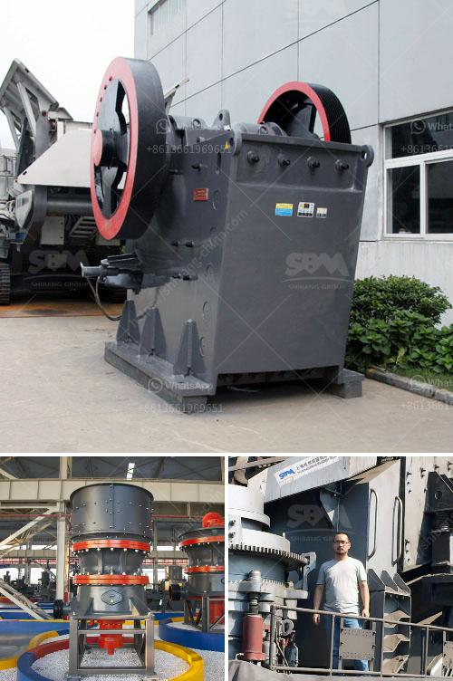

<h3>grinding size of bentonite crusher</h3>
The grinding size of a bentonite crusher is an important parameter that needs to be considered during the crushing process. This parameter directly affects the size of the final product that is produced from the crushing process. In this article, we will discuss the significance of the grinding size of a bentonite crusher and its impact on the overall crushing process.

Bentonite is a type of clay that is commonly used as a binding agent in various industries. It is widely used in the construction, agriculture, and pharmaceutical industries, among others. Due to its unique properties, bentonite needs to undergo a crushing process in order to be utilized effectively in different applications.

The grinding size of a bentonite crusher refers to the size of the finished product after the grinding process has taken place. It is generally expressed in terms of the mesh size, which is the number of holes per square inch of screen surface that the material can pass through. The smaller the mesh size, the finer the grinding size.

The grinding size of a bentonite crusher is crucial because it determines the particle size distribution of the final product. Different industries have different requirements for the particle size distribution of bentonite. For example, in the construction industry, a finer grinding size is preferred as it enhances the binding properties of bentonite. On the other hand, in the pharmaceutical industry, a coarser grinding size may be desired to achieve a more controlled release of the active ingredients.

To achieve the desired grinding size, various types of crushers can be used. These include jaw crushers, impact crushers, and cone crushers. Each type of crusher has its own advantages and disadvantages, and the choice of crusher will depend on factors such as the hardness of the bentonite, the required capacity, and the desired final product size.

In addition to the type of crusher, the grinding size of a bentonite crusher can also be influenced by other factors such as the feed rate, the moisture content of the bentonite, and the type of grinding media used. These factors can affect the efficiency of the grinding process and consequently, the grinding size of the final product.

In conclusion, the grinding size of a bentonite crusher is an important parameter that affects the quality and usability of the final product. It is influenced by factors such as the type of crusher used, the feed rate, and the moisture content of the bentonite. Therefore, it is crucial to consider these factors carefully when selecting a crusher and optimizing the grinding process. By doing so, industries can ensure that their bentonite is processed to the desired grinding size, thereby maximizing its effectiveness in various applications.
<h3>Contact us</h3><ul><li><strong>Whatsapp:&nbsp;<a href="https://wa.me/8613661969651">+8613661969651</a></strong></li><li><a href="https://swt.shibang-china.com/?git&amp;zhl&amp;grinding size of bentonite crusher"><strong>Online Service(chat now)</strong></a></li></ul><h3>Related</h3><ul><li><a href='diesel engines grinding mills south africa.md'>diesel engines grinding mills south africa</a></li><li><a href='quarry plant equipment.md'>quarry plant equipment</a></li><li><a href='sample method statement stone crushing.md'>sample method statement stone crushing</a></li><li><a href='prices for stone crushing machine zimbabwe.md'>prices for stone crushing machine zimbabwe</a></li><li><a href='limestone powder manufacture machine.md'>limestone powder manufacture machine</a></li></ul>