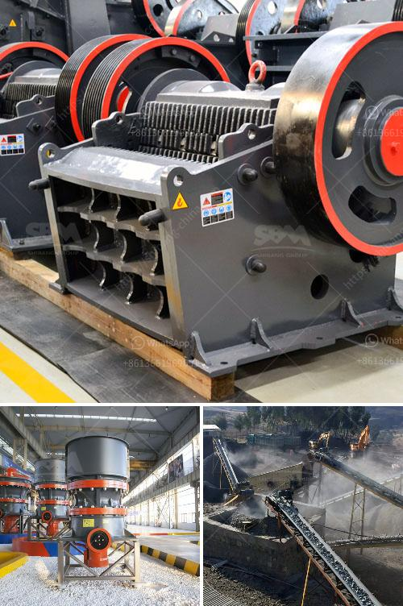

<h3>grinding tunbe mill and ball mill</h3>
Grinding is a common process used in various industries to reduce the size of a material into smaller particles. Two commonly used grinding mills are the tube mill and the ball mill. 

A tube mill is a rotating cylindrical shell filled with grinding media, such as steel balls, used to grind materials into fine powders. The material is fed into the mill through the inlet chute and ground by the impact of the steel balls as they collide with the material. The finer particles pass through the diaphragms and are discharged through the outlet end, while the coarser particles are recirculated back into the mill.

A ball mill, on the other hand, uses steel balls as the grinding media. Like the tube mill, the material is fed into the mill through the inlet chute and ground by the impact of the balls as they collide with the material. The ground material is discharged through the outlet end.

There are a few key differences between the tube mill and the ball mill. Firstly, the tube mill has a longer length compared to the ball mill, which ensures efficient grinding of finer particles. The ball mill, on the other hand, has a shorter length, which promotes easy and efficient material discharge.

Secondly, the tube mill operates with a lower rotational speed compared to the ball mill, resulting in reduced grinding efficiency. Additionally, the tube mill is also more sensitive to variations in the feed material properties, which can affect the grinding process.

Lastly, the ball mill is more versatile in terms of the range of materials it can grind. It is suitable for both dry and wet grinding, and can handle materials with varying hardness and abrasiveness. The tube mill, however, is primarily used for grinding softer materials.

In conclusion, both the tube mill and the ball mill are reliable grinding machines commonly used in various industries. While the tube mill is better suited for finer grinding and operates at lower speeds, the ball mill is more versatile and can handle a wider range of materials and grinding conditions. Ultimately, the choice between the two will depend on the specific requirements of the application.
<h3>Contact us</h3><ul><li><strong>Whatsapp:&nbsp;<a href="https://wa.me/8613661969651">+8613661969651</a></strong></li><li><a href="https://swt.shibang-china.com/?git&amp;zhl&amp;grinding tunbe mill and ball mill"><strong>Online Service(chat now)</strong></a></li></ul><h3>Related</h3><ul><li><a href='basalt fiber production lines.md'>basalt fiber production lines</a></li><li><a href='jaw crusher supplier in the philippines.md'>jaw crusher supplier in the philippines</a></li><li><a href='mobile crushing equipment for sale.md'>mobile crushing equipment for sale</a></li><li><a href='malaysia mineral ball mill.md'>malaysia mineral ball mill</a></li><li><a href='ball mill in mining.md'>ball mill in mining</a></li></ul>