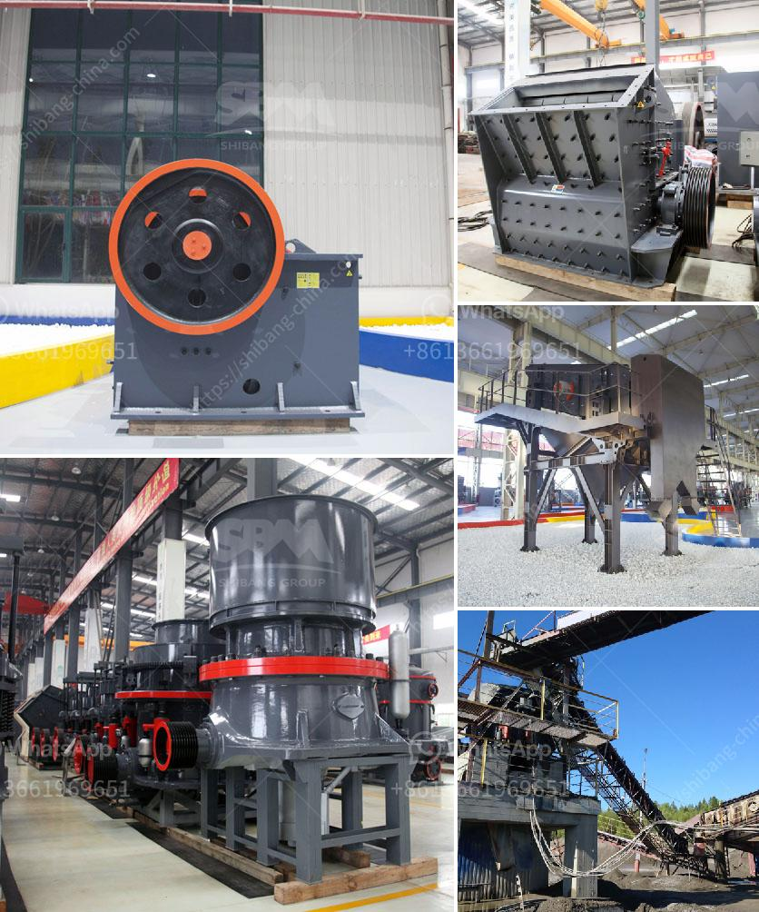

<h3>gypsum beneficiation plant</h3>
Gypsum, or calcium sulfate dihydrate, is a widely used mineral in many industries, such as cement production, building materials, and agriculture. However, its full potential is yet to be unlocked in various applications, which is where gypsum beneficiation plants come in.

A gypsum beneficiation plant is used to process gypsum into a premium product, which has numerous uses. In simple terms, beneficiation means separating the valuable mineral from the waste material. Gypsum beneficiation plants use various physical and chemical methods to separate the valuable gypsum from the waste, ensuring high-quality gypsum products.

The main goal of a gypsum beneficiation plant is to improve the purity and quality of gypsum for specific applications. The beneficiation process typically involves crushing, grinding, sieving, magnetic separation, and flotation. These processes enhance the brightness, whiteness, and purity of the gypsum, making it suitable for a wide range of applications.

One key application for high-quality gypsum is in the construction industry. Gypsum is used in plasterboards, cement, and concrete to improve their strength, elasticity, and fire resistance. By employing a beneficiation plant, the gypsum can be processed to meet the stringent requirements of construction materials, resulting in improved performance and durability.

Furthermore, gypsum beneficiation plants also have a positive impact on the environment. By removing impurities and reducing waste generation during the beneficiation process, these plants contribute to sustainable mining practices. The waste generated during beneficiation can also be reused in other industries or safely disposed of by following environmentally friendly methods.

In conclusion, a gypsum beneficiation plant plays a crucial role in enhancing the quality and usability of gypsum for various applications. By employing advanced techniques, these plants separate the valuable gypsum from impurities, leading to superior products. Additionally, the environmental benefits of gypsum beneficiation plants make them an essential component of sustainable mining practices.
<h3>Contact us</h3><ul><li><strong>Whatsapp:&nbsp;<a href="https://wa.me/8613661969651">+8613661969651</a></strong></li><li><a href="https://swt.shibang-china.com/?git&amp;zhl&amp;gypsum beneficiation plant"><strong>Online Service(chat now)</strong></a></li></ul><h3>Related</h3><ul><li><a href='slinger conveyor belt speed.md'>slinger conveyor belt speed</a></li><li><a href='crusher equipment price.md'>crusher equipment price</a></li><li><a href='mineral processing plants china.md'>mineral processing plants china</a></li><li><a href='mobile stone crushing machine for sale.md'>mobile stone crushing machine for sale</a></li><li><a href='used crusher for sale in fujairah.md'>used crusher for sale in fujairah</a></li></ul>