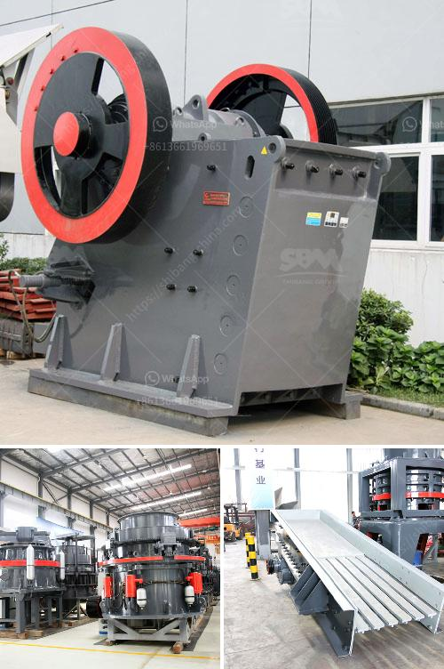

<h3>gypsum beneficiation process</h3>
Gypsum is a mineral compound commonly used in the construction industry. It is also known as plaster of Paris or calcium sulfate dihydrate. Gypsum deposits are abundant worldwide, and its mining and processing have been carried out for centuries.

The beneficiation process of gypsum involves crushing, screening, and grinding to extract the gypsum powder, which is then used in the production of plasterboard, gypsum plaster, and other construction materials. The extraction process usually involves open-pit mining, where the gypsum is extracted from the ground using explosives or mechanical equipment.

Once the gypsum is extracted, it is crushed into smaller pieces and then screened to remove impurities such as clay, rocks, and other debris. The screened gypsum is then sent to a grinding mill, where it is ground into a fine powder. This grinding process not only reduces the size of the gypsum particles but also increases its surface area, improving its reactivity.

After the grinding process, the gypsum powder is ready to be used in various applications. One of the main uses of gypsum is in the production of plasterboard, which is widely used for walls and ceilings in buildings. The gypsum powder is mixed with water to form a paste, which is then spread on a paper backing and dried to form the plasterboard sheets.

In addition to plasterboard, gypsum powder is also used in the manufacturing of gypsum plaster, a material used for plastering walls and ceilings. It can also be used for making decorative items such as statues, ornaments, and molds.

The beneficiation process of gypsum is an essential step in the production of various construction materials. It ensures the purity and quality of the gypsum powder, making it suitable for a wide range of applications. The process not only enhances the physical properties of gypsum but also improves its reactivity, making it easier to work with and more durable in use.

Overall, gypsum beneficiation plays a crucial role in the construction industry by providing a reliable and high-quality material for various applications. With the growing demand for construction materials, the process of gypsum beneficiation is expected to continue playing a vital role in meeting the industry's needs.
<h3>Contact us</h3><ul><li><strong>Whatsapp:&nbsp;<a href="https://wa.me/8613661969651">+8613661969651</a></strong></li><li><a href="https://swt.shibang-china.com/?git&amp;zhl&amp;gypsum beneficiation process"><strong>Online Service(chat now)</strong></a></li></ul><h3>Related</h3><ul><li><a href='new technology stone crusher in india.md'>new technology stone crusher in india</a></li><li><a href='differnce between raw mill and ball mill.md'>differnce between raw mill and ball mill</a></li><li><a href='ball mill manufacturers in malaysia.md'>ball mill manufacturers in malaysia</a></li><li><a href='price conveyor belt.md'>price conveyor belt</a></li><li><a href='gypsum grinding machine suppliers.md'>gypsum grinding machine suppliers</a></li></ul>