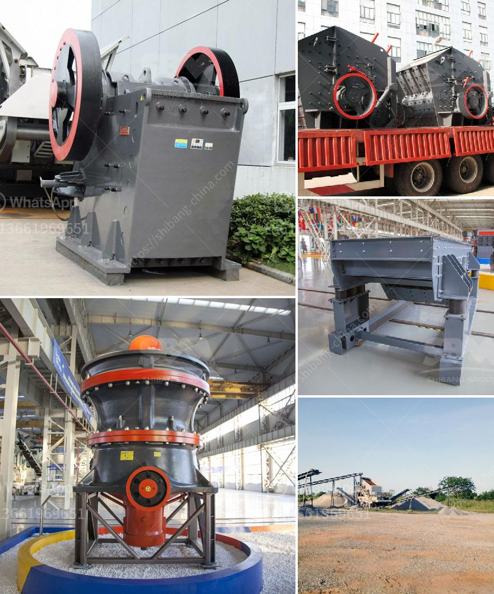

<h3>gypsum board making plant from germany</h3>
Germany is renowned for its advanced technology and engineering expertise, and it comes as no surprise that it is home to several gypsum board making plants. Gypsum board, also known as drywall or plasterboard, is a widely used building material for interior walls and ceilings. It provides a smooth and fire-resistant surface while also promoting thermal insulation.

The gypsum board making plants in Germany employ highly trained professionals who use state-of-the-art technology and machinery. These plants produce high-quality gypsum boards that are uniform in thickness and perfectly finished. The gypsum boards manufactured in Germany are known for their excellent durability and long-lasting performance.

One of the distinct advantages of the German gypsum board making plants is their commitment to environmental sustainability. They adhere to strict regulations and employ eco-friendly processes that minimize waste and reduce environmental impact. These plants also incorporate recycling techniques into their production, ensuring a minimal carbon footprint.

Moreover, the German gypsum board making plants prioritize the safety and well-being of their workers by adopting stringent safety measures. They invest in modern equipment and provide comprehensive training to ensure a safe and healthy workplace.

Germany's gypsum board making plants have gained international recognition for their reliability, precision, and efficiency. They export their products to various countries, contributing to the global construction industry. Contractors and builders worldwide prefer German-made gypsum boards due to their superior quality and consistent performance.

In conclusion, the gypsum board making plants from Germany are at the forefront of technological innovation, producing high-quality boards that meet international standards. Their commitment to sustainability and worker safety further adds to their reputation as industry leaders. Whether it is a small interior renovation or a large-scale construction project, the German gypsum boards are the top choice for professionals and consumers alike.
<h3>Contact us</h3><ul><li><strong>Whatsapp:&nbsp;<a href="https://wa.me/8613661969651">+8613661969651</a></strong></li><li><a href="https://swt.shibang-china.com/?git&amp;zhl&amp;gypsum board making plant from germany"><strong>Online Service(chat now)</strong></a></li></ul><h3>Related</h3><ul><li><a href='stone crusher plant ton jam.md'>stone crusher plant ton jam</a></li><li><a href='balls level in ball mill.md'>balls level in ball mill</a></li><li><a href='ethiopia crusher jaw crusher.md'>ethiopia crusher jaw crusher</a></li><li><a href='cost of a manganese processing plant in south africa.md'>cost of a manganese processing plant in south africa</a></li><li><a href='crusher machine ball media.md'>crusher machine ball media</a></li></ul>