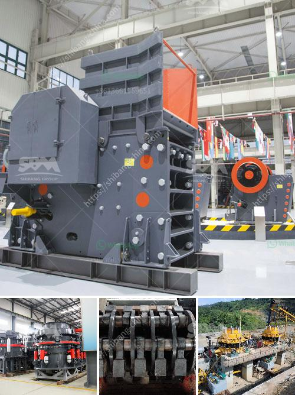

<h3>gypsum ceiling plant price in pakistan</h3>
Gypsum ceilings have become increasingly popular in Pakistan due to their aesthetic appeal and durability. As a result, there is a growing demand for gypsum ceiling plants in the country. However, there are various factors that affect the price of gypsum ceiling plants in Pakistan.

One of the key factors that influence the price of gypsum ceiling plants is the size of the plant. Larger plants are generally more expensive as they require more materials and manpower to construct. Moreover, the size of the plant also affects its production capacity, with larger plants capable of producing a higher quantity of gypsum ceiling panels.

Another factor that affects the price of gypsum ceiling plants is the quality of materials used. High-quality materials, such as premium-grade gypsum boards and metal frames, can increase the cost of the plant. Additionally, the type of gypsum ceiling design also plays a role in determining the price. More intricate and complex designs may require additional time and skill to manufacture, resulting in a higher price.

Furthermore, the brand and reputation of the manufacturer also impact the price of gypsum ceiling plants. Well-established and renowned manufacturers may charge a premium for their products due to their reputation for quality and reliability. On the other hand, newer or lesser-known manufacturers may offer more competitive prices to attract customers.

In terms of pricing, gypsum ceiling plants in Pakistan can range from around PKR 200,000 to PKR 1,000,000 or more, depending on the aforementioned factors. It is important for buyers to do thorough research and consider their budget and requirements before making a purchase.

In conclusion, the price of gypsum ceiling plants in Pakistan is influenced by various factors, including the size of the plant, quality of materials used, type of design, and the brand of the manufacturer. Buyers should consider these factors and conduct proper market research to find the most suitable plant that fits their budget and requirements. With the growing popularity of gypsum ceilings in Pakistan, investing in a gypsum ceiling plant can be a lucrative opportunity for businesses in the construction and interior design industry.
<h3>Contact us</h3><ul><li><strong>Whatsapp:&nbsp;<a href="https://wa.me/8613661969651">+8613661969651</a></strong></li><li><a href="https://swt.shibang-china.com/?git&amp;zhl&amp;gypsum ceiling plant price in pakistan"><strong>Online Service(chat now)</strong></a></li></ul><h3>Related</h3><ul><li><a href='mini concrete crusher portable for rent.md'>mini concrete crusher portable for rent</a></li><li><a href='impact crushers saudi.md'>impact crushers saudi</a></li><li><a href='jaw crusher saudi small capacity.md'>jaw crusher saudi small capacity</a></li><li><a href='used machines philippines ball mill.md'>used machines philippines ball mill</a></li><li><a href='cost of establishing a quarry in nigeria.md'>cost of establishing a quarry in nigeria</a></li></ul>