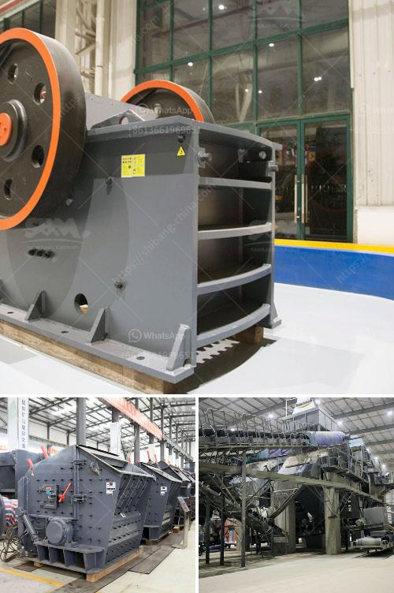

<h3>gypsum chromium limestone mining</h3>
Mining is an essential industry in many countries worldwide. It provides valuable resources that are used in various sectors, including construction, manufacturing, agriculture, and energy production. However, as society becomes more aware of the environmental impacts of mining, there is an increasing demand for sustainable mining practices. This article will focus on three important minerals – gypsum, chromium, and limestone – and discuss their mining processes and the steps taken towards sustainability.

Gypsum is a mineral commonly used in the construction industry due to its fire-resistant and soundproofing properties. In the mining process, gypsum is typically extracted from open-pit mines or underground mines using heavy machinery. However, mining activities can have detrimental effects on the surrounding ecosystems and communities if not properly managed.

To promote sustainable mining practices, several measures can be put in place. First and foremost, comprehensive environmental impact assessments should be conducted to evaluate the potential risks and come up with mitigation strategies. This includes proper waste management, preventing habitat destruction, and establishing monitoring systems to track environmental changes over time.

Chromium is another mineral used in various industries, such as metallurgy, chemicals, and refractories. It is primarily mined from chromite ore, typically found in underground deposits. Extracting chromium can have severe environmental consequences, including soil erosion, water pollution, and habitat destruction.

To ensure sustainable chromium mining, strict regulations and guidelines need to be implemented. This includes proper waste disposal to prevent the release of harmful substances into the environment, reclamation of mined-out areas to restore the land, and the use of energy-efficient machinery to reduce carbon emissions. Additionally, conducting regular water quality tests and implementing water conservation measures are crucial steps towards sustainability.

Limestone, a sedimentary rock composed mainly of calcium carbonate, is another valuable mineral used extensively in construction and various industrial processes. The extraction of limestone involves large-scale quarrying operations, which can cause significant habitat fragmentation and loss, noise pollution, and dust emissions.

Promoting sustainable limestone mining involves the adoption of best practices to minimize adverse impacts. Reclamation of quarries is of utmost importance to restore biodiversity and prevent erosion. Implementing dust suppression techniques and utilizing cutting-edge technology can help reduce dust emissions and noise pollution.

Moreover, limestone mining also has the potential for positive environmental impacts. For instance, abandoned limestone quarries can be transformed into scenic landscapes, recreational areas, or even be used for water storage. This demonstrates how mining activities can be integrated into sustainable land use planning.

In conclusion, sustainable mining practices are crucial for the long-term viability of the mining industry and the protection of the environment. Gypsum, chromium, and limestone mining, like any other mining activities, have the potential to cause environmental harm if not properly managed. However, through the adoption of comprehensive environmental impact assessments, strict regulations, and the implementation of mitigation measures, mining can be done sustainably. With sustainable practices in place, we can ensure that these valuable mineral resources are responsibly extracted, benefiting both industries and the environment.
<h3>Contact us</h3><ul><li><strong>Whatsapp:&nbsp;<a href="https://wa.me/8613661969651">+8613661969651</a></strong></li><li><a href="https://swt.shibang-china.com/?git&amp;zhl&amp;gypsum chromium limestone mining"><strong>Online Service(chat now)</strong></a></li></ul><h3>Related</h3><ul><li><a href='german crusher for sale.md'>german crusher for sale</a></li><li><a href='calcium carbonate powder crushing crusher usa.md'>calcium carbonate powder crushing crusher usa</a></li><li><a href='want mobile crusher on rent pune india.md'>want mobile crusher on rent pune india</a></li><li><a href='jaw crushers zimbabwe.md'>jaw crushers zimbabwe</a></li><li><a href='calcite costing of processing equipment.md'>calcite costing of processing equipment</a></li></ul>